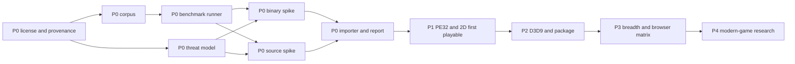

# Browser Porting Toolkit roadmap

## Decision summary

BPTK is feasible as a staged compatibility workbench. The browser building block already exist, and BottleShip now demonstrates a remarkably close binary-runtime architecture. What is not feasible is an unrestricted execution guarantee across arbitrary Windows game, hardware era, middleware, DRM, driver, and network model.

The product should therefore compete on the full porting workflow:

```text
import -> inspect -> choose lane -> adapt -> benchmark -> diagnose -> package -> embed -> publish evidence
```

The differentiator is one workbench joining binary compatibility, source-assisted porting, engine-family adapter, truthful compatibility reporting, and framework-neutral packaging. The P0 decision may lead to collaboration with or adaptation of BottleShip; rebuilding its demonstrated surface without measured cause is not the strategy.

The larger ambition — universal browser game runtime + library + platform, **recompilation-first**, any origin and any era — and the full forward item catalogue (`GS-###`, ten pillars) live in the [gold-standard program](doc/roadmap-gold-standard.md). Every item is now ratified below as a `BPTK-046`–`BPTK-145` row with its benchmark spec, so this file and `npm run gate` stay the single source of ratified truth; ratification is a work-list contract, not an implementation claim.

## Current truth

- Initial repository state: empty directory with no git repository, license, runtime, test, or documentation.
- Current repository state: public Apache-2.0 roadmap package, validation harness, and dependency-free `@bygelo/bptk@0.1.0-alpha.0` status and environment-diagnostic CLI.
- Product implementation: BPTK-003 live benchmark and promotion checks, BPTK-007 safe local inspection, BPTK-008 bounded static PE32 mapping, BPTK-017 live browser graphics probing, BPTK-037 middleware and protection census, BPTK-038 bounded installer extraction, BPTK-009 i386 execution baseline, BPTK-039 monotonic guest clock, BPTK-043 engine-family census, BPTK-044 declared resource bound, BPTK-045 guest containment policy, BPTK-010 Win32 core HLE, the BPTK-015 virtual-drive and registry slice, and the BPTK-103 locale and codepage slice are implemented but red. A bounded opt-in i386 entry probe is now reachable through `run`, but it is only partial work toward BPTK-009; no guest-execution game-runtime item passes.
- CLI boundary: every literal Surface invocation below is reachable, plus `bptk ingest`, which classifies, census-routes, and packages any executable input into a bundle without executing it. `legal`, `corpus status`, `security`, `inspect`, `benchmark`, `foundation compare`, `port`, `run`, `import`, `doctor --graphics`, `package`, `compatibility`, and `report` perform bounded local analysis, live self-check, toolchain diagnosis, PE32 image mapping, live browser capability observation, atomic asset packaging, host emission, policy validation, or privacy-minimized reporting without uploading game code. Most input is never executed. Only a PE32 package that explicitly selects `i386_probe_v1` and supplies an instruction budget runs the bounded probe locally: an image whose every import is served by the Win32 core HLE executes with import call dispatched through the HLE thunk page and TLS callback firing before the entry, while a partially served image is refused with the unserved surface named. Shared `run` surfaces otherwise report the same missing runtime unless a narrower diagnostic option applies.
- Foundation state: legal and security command output explicitly requires named review, corpus status publishes no denominator without approval, foundation comparison measures only locally available options, and source porting reports the missing Emscripten and adapter step without emitting a scaffold. The PE32 mapper bounds header, section, image, relocation, import, TLS, stack, heap, and executable entry-point state; a package may resolve ordinary named and ordinal import to declared static address. The opt-in i386 entry probe supports a bounded integer subset, stack, control flow, flags, ModRM memory access, and self-modification, while x87, full instruction coverage, full exception behavior, the unserved Win32 breadth (user32, gdi32, storage, locale), and any game loop remain blocked. The ephemeral Chrome probe observes WebGL2, WebGL, AudioContext, isolation, SharedArrayBuffer, and renderer state; the current host is degraded because it lacks cross-origin isolation, and this does not prove another browser. The packager emits content-addressed assets atomically plus HTML or React host source against one package identity; no supported game runtime is included. Package integrity timing verifies chunk hash on cold and warm reads but cannot measure a game. Thread, network, and control command validate selection or policy without a worker, network, or input bridge. Engine diagnosis never copies the asset because no approved adapter exists. Compatibility observes installed Chrome, reports installed-but-unprobed Safari and absent Firefox, and never emits a support claim without a runtime. Local report recording is off by default and consent output excludes game content and personal data, but there is no session to reproduce. BPTK-001, BPTK-002, and BPTK-004 remain planned because command output cannot manufacture approval. BPTK-003, BPTK-007, BPTK-008, BPTK-009, BPTK-017, BPTK-037, BPTK-038, BPTK-039, BPTK-043, BPTK-044, BPTK-045, BPTK-083, BPTK-084, BPTK-085, BPTK-086, BPTK-127, BPTK-130, BPTK-132, BPTK-133, BPTK-134, BPTK-135, BPTK-088, BPTK-089, BPTK-093, BPTK-129, BPTK-076, BPTK-081, BPTK-121, BPTK-124, BPTK-125, BPTK-059, BPTK-061, BPTK-063, BPTK-065, and BPTK-066, BPTK-109, BPTK-116, BPTK-010, BPTK-015, and BPTK-103 are implemented but red because their prerequisite, approved corpus input, or complete profile remain red. The installer extractor unpacks the pinned Inno Setup 6 unicode family and an MSCF cabinet with stored or MSZIP folder without executing installer code, while encrypted, BZip2, and LZMA chunk are refused with their identity. Full source compilation, full i386 conformance, Win32 HLE, browser input, GDI, DirectDraw, game audio, persistence, integrated import, runtime host behavior, and compatibility reproduction are weeks-scale and remain planned.
- Current benchmark coverage: **0 / 145 (0%)**.
- Empirical corpus: nine lawful freeware entry acquired and hash-verified outside the repository, each run through the real ingest and run path with the reached stage and a named generic gap ([the empirical report](doc/empirical-corpus-report.md)).
- Closest prior art: BottleShip for unmodified PE32 game; Emscripten for source-assisted game; OpenSA, WebXash, Qwasm2, and ScummVM for engine-family or asset-driven path.

## Product contract

### Minimum promise

BPTK accepts a supported local input form, inspects it without execution, and returns a precise compatibility report. A runnable package is emitted only if its capability path passes an active benchmark.

### First execution target

- DRM-free PE32 and i386 game from the DirectDraw through Direct3D 9 era;
- client-side execution;
- GDI, DirectDraw, selected D3D7/8/9, waveOut or DirectSound, Win32 file and registry behavior;
- WebGPU primary profile with declared WebGL2 fallback where the required feature maps safely;
- local folder, ZIP, BPTK bundle, and explicitly supported installer import;
- plain HTML canvas host plus a thin React lifecycle adapter.

### Early exclusion

- DRM circumvention and kernel anti-cheat;
- kernel driver and arbitrary native device access;
- x86-64 and Direct3D 10–12 outside P4 research;
- server-side native game streaming as a compatibility substitute;
- bundled commercial game executable or asset;
- a title status without toolkit revision and environment evidence.

## Discovery denominator

The raw candidate denominator was frozen after deduplication on 2026-07-18 and extended on 2026-09-05 by the gold-standard program promotion: 100 newly discovered candidate were added and classified accepted in the same change, per the rule below.

| Candidate source | Count | Example signal |
|---|---:|---|
| Initial repository state | 4 | License, implementation, test, and documentation were absent |
| User and product objective | 90 | Broad import, Windows input, browser output, canvas, React host, Maphy ownership, Apple-like workflow; the gold-standard program design item |
| Prior-art capability and limitation | 51 | CPU, PE, Win32, DirectX, source toolchain, engine adapter, package, compatibility evidence, browser-runtime and static-recompilation prior art, middleware and copy-protection census, installer, timing, full-motion video, redistributable runtime, source-lane build profile, and engine-family routing; the recompilation, emulator, and accessibility prior-art item |
| Browser, distribution, and security constraint | 14 | GPU availability, thread isolation, socket limit, storage, user content, copyleft, trademark, hostile import, resource exhaustion, and guest containment |
| **Raw** | **159** | Frozen denominator plus the gold-standard promotion |

| Decision | Count |
|---|---:|
| Accepted into this roadmap | 145 |
| Rejected | 8 |
| Deferred | 6 |
| Implemented | 40 |
| Passing | 0 |

The complete identity, origin, dedupe key, decision, and target mapping is frozen in [the candidate ledger](bench/roadmap/candidate.json); [the rejection and defer ledger](doc/roadmap-rejected.md) explains the non-accepted decisions. A future change may alter the denominator only by adding a newly discovered raw candidate and classifying it in the same change.

## Benchmark contract

Each accepted item now uses one quadruple: **Behavior**, **Surface**, **Benchmark**, and **Tier**. Behavior names what a user gets. Surface is the literal invocation the product must expose; an invocation shown here is a planned contract, not a claim that it exists today. Benchmark names the evidence that protects the behavior. Tier sets how often and how strongly that evidence gates change:

- **Tier 1** — release-blocking regression coverage for a named failure that could silently corrupt, escape, disclose, or invalidate a supported user result;
- **Tier 2** — reserved for a future intermediate gate when a concrete project need justifies it;
- **Tier 3** — the default for planning evidence, bounded research, review, and behavior not yet exposed as a supported product contract.

The specifications under [bench/roadmap/spec](bench/roadmap/README.md) remain acceptance contracts, but `bench/` is not the deliverable. Tier 3 uses a written falsifiable acceptance line only. Tier 1 may use a live or temporary generated check, but no committed baseline, retained-evidence JSON, or golden fixture. A benchmark promotes only the user behavior named in its roadmap row, and command existence cannot satisfy an operational prerequisite. All 145 remain red today; BPTK-003, BPTK-007, BPTK-008, BPTK-009, BPTK-017, BPTK-037, BPTK-038, BPTK-039, BPTK-043, BPTK-044, BPTK-045, BPTK-083, BPTK-084, BPTK-085, BPTK-086, BPTK-127, BPTK-130, BPTK-132, BPTK-133, BPTK-134, BPTK-135, BPTK-088, BPTK-089, BPTK-093, BPTK-129, BPTK-076, BPTK-081, BPTK-121, BPTK-124, BPTK-125, BPTK-059, BPTK-061, BPTK-063, BPTK-065, and BPTK-066, BPTK-109, and BPTK-116 are active and implemented, while the other 108 are gate-excluded. [The test contract](doc/TESTING.md) defines promotion.

[bench/roadmap/manifest.json](bench/roadmap/manifest.json) remains the machine-readable source for identity, prerequisite, and promotion state. This roadmap owns the user behavior, literal surface, and benchmark tier.

## Critical path



P0 is a funding and architecture gate. If neither binary option meets the frozen budget, the honest outcome is a source-first toolkit, not an unbounded rewrite.

## P0 — Prove the product and choose the foundation

P0 ends when the legal, evidence, security, binary, source, and import premise is proven on one denominator.

| ID | Behavior | Surface | Benchmark | Source | Tier | Dependency · Owner |
|---|---|---|---|---|---|---|
| BPTK-001 | Know whether a project can be published and which upstream component may be reused | `bptk legal <project>` | [BENCH-001](bench/roadmap/spec/bptk-001.json): returns an approved, revisioned license, provenance, naming, and reuse decision; approval remains open | SRC-001–006/008/009/012–015 | Tier 3 | — · Product + legal |
| BPTK-002 | See compatibility claims against a stable, representative denominator | `bptk corpus status` | [BENCH-002](bench/roadmap/spec/bptk-002.json): freezes lawful fixture, environment profile, and threshold before any percentage is published; corpus review remains open | SRC-002/003/004/006/010/011 | Tier 3 | 001 · Compatibility |
| BPTK-003 | Trust that roadmap status changes only when live evidence passes | `bptk benchmark` | [BENCH-003](bench/roadmap/spec/bptk-003.json): runs deterministic in-memory checks and enforces content-addressed promotion state without retaining a result; passing remains blocked by legal and corpus prerequisite | SRC-002/003/011/013 | **Tier 1** — regression risk: a false-green result promotes unsupported behavior | 001, 002 · Tooling |
| BPTK-004 | Know how an imported game is isolated before opening it | `bptk security <input>` | [BENCH-004](bench/roadmap/spec/bptk-004.json): reviews archive, parser, memory, permission, network, storage, privacy, and hostile-code control; named review remains open | SRC-002/003/009/019/020/023–026 | Tier 3 | 001 · Security |
| BPTK-005 | Get a measured recommendation for the binary-runtime foundation | `bptk foundation compare <input>` | [BENCH-005](bench/roadmap/spec/bptk-005.json): compares adaptation, composition, and new-runtime option on one frozen fixture; no option is selected | SRC-002–005/012/013 | Tier 3 | 001–004 · Runtime |
| BPTK-006 | Turn a supported SDL/OpenGL source project into a runnable browser package | `bptk port --source <project>` | [BENCH-006](bench/roadmap/spec/bptk-006.json): builds from clean source and runs the declared browser profile; no Wasm browser package exists | SRC-006/007/010/016–018 | Tier 3 | 001–004 · Source port |
| BPTK-007 | Drop in a local project and get a safe route or precise blocked reason | `bptk inspect <input>` | [BENCH-007](bench/roadmap/spec/bptk-007.json): classifies folder, archive, installer, PE, source, and engine asset without execution or upload; classifier implemented, prerequisite and full matrix remain red | SRC-002/003/008–011 | **Tier 1** — regression risk: inspection executes input, escapes a path boundary, or selects the wrong lane | 002–006 · Workbench |

### P0 exit gate

- BPTK-001 through BPTK-007 are active and passing.
- One binary option runs the frozen PE32 comparison fixture inside the BPTK-002 budget, or the project explicitly records source-first scope.
- The source fixture builds from a clean checkout and runs in the declared browser profile.
- Invalid and hostile import returns a bounded error without execution, upload, or partial storage.
- The name, license, reuse strategy, and threat model have named reviewer and expiry trigger.

## P1 — Reach a truthful PE32 and 2D first playable

P1 builds the minimum binary path for classic 2D and software-rendered interface. It does not claim broad title support.

| ID | Behavior | Surface | Benchmark | Source | Tier | Dependency · Owner |
|---|---|---|---|---|---|---|
| BPTK-008 | Open an eligible PE32 game into a bounded, correctly resolved memory image | `bptk run <package>` | [BENCH-008](bench/roadmap/spec/bptk-008.json): the product CLI maps section, HIGHLOW relocation, declared named or ordinal import, TLS metadata, stack, heap, and executable entry point deterministically; prerequisite and approved corpus evidence remain red, and no guest instruction executes | SRC-002/003/004 | Tier 3 | 005, 007 · Runtime |
| BPTK-009 | Run supported i386 game code with stable register, FPU, memory, and exception behavior | `bptk run <package>` | [BENCH-009](bench/roadmap/spec/bptk-009.json): a bounded integer and FPU entry probe with shift, rotate, multiply, divide, setcc, string, the operand-size override with exact 16-bit flag and stack semantics, and 64-bit precision x87 behavior is reachable through the real `bptk run` surface, but the frozen instruction, FPU, exception, memory, and reference-state suite still cannot pass | SRC-002–005 | **Tier 1** — regression risk: silent CPU divergence changes game state or crashes later in an unrelated subsystem | 005, 008 · Runtime |
| BPTK-010 | Start and keep a supported Win32 game loop running in the browser | `bptk run <package>` | [BENCH-010](bench/roadmap/spec/bptk-010.json): the Win32 core HLE serves 67 kernel32 and ole32 export with guest import call dispatched through a bounded thunk page, every export covered by the conformance suite, and the FIX-003 exerciser exits through its golden trace; the frozen denominator and the full Win32 breadth remain red | SRC-002/003/012/013 | Tier 3 | 009 · Compatibility |
| BPTK-011 | Control a game through browser focus, keyboard, pointer, cursor, timer, and window lifecycle | `bptk run <package>` | [BENCH-011](bench/roadmap/spec/bptk-011.json): replays deterministic USER32 message and input order; no browser bridge exists | SRC-002/003/009 | Tier 3 | 010 · Browser runtime |
| BPTK-012 | See launchers, menus, text, and software-rendered output correctly | `bptk run <package>` | [BENCH-012](bench/roadmap/spec/bptk-012.json): compares GDI image and trace evidence within declared tolerance; no GDI output exists | SRC-003/012 | Tier 3 | 011 · Graphics |
| BPTK-013 | See a supported DirectDraw game render and present a correct 2D frame | `bptk run <package>` | [BENCH-013](bench/roadmap/spec/bptk-013.json): verifies surface, lock, blit, flip, palette, color-key, pitch, and presentation semantics; no browser frame exists | SRC-002/003 | Tier 3 | 010, 011 · Graphics |
| BPTK-014 | Hear supported waveOut and DirectSound audio in sync with play | `bptk run <package>` | [BENCH-014](bench/roadmap/spec/bptk-014.json): checks PCM, buffer, loop, volume, pan, callback, pause, and underrun behavior; no Web Audio bridge exists | SRC-002–004/019/021 | Tier 3 | 010 · Audio |
| BPTK-015 | Save settings and progress across reload without changing the original game files | `bptk run <package> --save <profile>` | [BENCH-015](bench/roadmap/spec/bptk-015.json): the HLE core serves a bounded virtual drive and an in-memory registry hive with real file, seek, console-mode, and registry semantics and a storage exerciser through the run surface; copy-on-write, quota transaction, reload persistence, and the OPFS bridge remain red | SRC-002/009/010/022/023 | **Tier 1** — regression risk: a save is lost, aliased to another path, corrupted, or written outside its sandbox | 004, 010 · Storage |
| BPTK-016 | Import a supported package and reach one interactive, persistent 2D session | `bptk import <input> --run` | [BENCH-016](bench/roadmap/spec/bptk-016.json): temporary package diagnosis proves no staging or execution occurs; CPU, Win32, input, graphics, audio, storage, save, reload, and integrated first playable remain unavailable | SRC-002/003/010/022/023 | **Tier 1** — regression risk: individually passing components stop working as one launchable session | 004, 007–015 · Integration |
| BPTK-034 | Service blocking Win32 and synchronous storage over an asynchronous browser API | `bptk run <package>` | [BENCH-034](bench/roadmap/spec/bptk-034.json): a JSPI blocking-call bridge with an Asyncify fallback services synchronous Win32 wait, sleep, and file and OPFS access; no Win32 HLE or storage overlay exists yet, so no blocking call can complete | SRC-030/033 | **Tier 2** — regression risk: a mis-serviced blocking call stalls, deadlocks, or corrupts guest state | 010, 015 · Runtime |
| BPTK-035 | Dispatch, unwind, and vectorize i386 code on a portable WebAssembly 3.0 substrate | `bptk run <package>` | [BENCH-035](bench/roadmap/spec/bptk-035.json): tail-call dispatch, exnref unwinding, and relaxed SIMD run with strict and legacy fallback; only a bounded integer entry probe exists, so the substrate suite cannot pass | SRC-029/031 | **Tier 2** — regression risk: a substrate that assumes one browser feature set loses correctness or performance where it is absent | 009 · Runtime |
| BPTK-037 | Route a title to handle, warn, extract, or refuse from a static middleware and copy-protection census | `bptk inspect <input>` | [BENCH-037](bench/roadmap/spec/bptk-037.json): the census routes middleware import and SafeDisc loader evidence through the real `bptk inspect` surface into handle, warn, extract, or refuse without executing the input or circumventing any protection; the labelled corpus evidence remains red | SRC-033/034 | **Tier 2** — regression risk: a mis-route accepts a protected or unsupported binary as portable or refuses a portable title | 007 · Compatibility |
| BPTK-038 | Extract a supported installer to the game payload without executing it | `bptk import <input> --extract <dir>` | [BENCH-038](bench/roadmap/spec/bptk-038.json): the extractor unpacks the pinned Inno Setup 6 unicode family and an MSCF cabinet with stored or MSZIP folder through the real `bptk import` surface and refuses a 16-bit setup stub, an encrypted or LZMA chunk, a checksum mismatch, and a payload path escape; the frozen corpus evidence remains red | SRC-033/036 | Tier 3 | 007 · Import |
| BPTK-039 | Serve every guest time source from one monotonic clock | `bptk run <package>` | [BENCH-039](bench/roadmap/spec/bptk-039.json): the clock layer derives QPC, RDTSC, tick, multimedia, and vertical-blank time from one monotonic source with clamped delta and serves the probe RDTSC through the real `bptk run` surface; Win32 HLE serving the remaining source and the frozen workload evidence remain red | SRC-035 | **Tier 1** — regression risk: divergent clocks slow, double-speed, or busy-spin the game and desync audio and physics | 010 · Runtime |
| BPTK-040 | Play supported full-motion-video middleware in sync with the game | `bptk run <package>` | [BENCH-040](bench/roadmap/spec/bptk-040.json): decodes supported Bink, Smacker, and VP6 through the browser frame and audio and refuses a proprietary WMV or Indeo bitstream; no frame or audio bridge exists | SRC-033/037 | Tier 3 | 013, 014 · Graphics |
| BPTK-041 | Provide the redistributable runtime a supported game expects | `bptk run <package>` | [BENCH-041](bench/roadmap/spec/bptk-041.json): resolves an exact D3DX, XInput, XAudio, CRT, VB6, and DirectMusic instrument dependency from a redistributable-only kit and reports an unmet one; no Win32 HLE exists | SRC-038 | Tier 3 | 010 · Runtime |
| BPTK-044 | Bound extraction, streaming, and execution against resource exhaustion | `bptk import <input>` | [BENCH-044](bench/roadmap/spec/bptk-044.json): the declared bound layer refuses a decompression-bomb fixture at the declared amplification bound and the probe enforces the declared instruction budget; the streaming and OPFS quota half and the frozen corpus evidence remain red | SRC-041 | **Tier 1** — regression risk: an unbounded extraction or execution path is a denial-of-service and quota-exhaustion vector | 004 · Security |
| BPTK-045 | Contain guest execution to a policy that cannot reach host capability | `bptk run <package>` | [BENCH-045](bench/roadmap/spec/bptk-045.json): the declared containment policy is enforced over the probe path and refuses an execution manifest that declares capability outside it, while guest memory stays confined to the mapped image and bounded stack; the browser-side policy surfaces remain red | SRC-024 | **Tier 1** — regression risk: a containment gap turns an imported game into a host-compromise or data-exfiltration vector | 004 · Security |

### P1 exit gate

- The synthetic PE32 2D fixture reaches `interactive` with correct visual, input, audio, and API artifact.
- Save and registry mutation survive reload without modifying the read-only base.
- Malformed executable and package corpus fail closed under resource limit.
- One user-owned, metadata-only pilot may be evaluated locally, but its asset is not retained or published and its status is not generalized.

## P2 — Deliver Direct3D 9, source SDK, performance, and package output

P2 produces the first package that demonstrates the product’s Windows-to-browser value across both binary and source lane.

| ID | Behavior | Surface | Benchmark | Source | Tier | Dependency · Owner |
|---|---|---|---|---|---|---|
| BPTK-017 | Know whether this browser can run the package, use a safe fallback, or must block | `bptk doctor --graphics` | [BENCH-017](bench/roadmap/spec/bptk-017.json): live ephemeral Chrome probe observes WebGPU, WebGL2, WebGL, audio, isolation, shared memory, fallback, and reason-bound blocking; prerequisite and complete browser profile remain red | SRC-002/007/014–016/020 | Tier 3 | 003, 004 · Graphics |
| BPTK-018 | Play supported D3D7/8 fixed-function content on the selected browser GPU path | `bptk run <package>` | [BENCH-018](bench/roadmap/spec/bptk-018.json): compares legacy state, transform, resource, cache, and presentation behavior; no GPU translator exists | SRC-002/007/014 | Tier 3 | 013, 017 · Graphics |
| BPTK-019 | Play supported D3D9 fixed-function content through device loss and reset | `bptk run <package>` | [BENCH-019](bench/roadmap/spec/bptk-019.json): verifies resource, state block, target, scene, loss, reset, restoration, and teardown; no D3D9 device path exists | SRC-002/007/014 | Tier 3 | 018 · Graphics |
| BPTK-020 | Render supported D3D9 shader-model 1–3 content correctly and deterministically | `bptk run <package>` | [BENCH-020](bench/roadmap/spec/bptk-020.json): validates bytecode, IR, reflection, cache, precision, control flow, resource, and frame result; no translator or compiler exists | SRC-001/002/014/015/020 | **Tier 1** — regression risk: a backend-specific shader miscompile silently renders the wrong game state | 019 · Shader |
| BPTK-021 | Port a supported native source project reproducibly with a documented adapter SDK | `bptk port --source <project>` | [BENCH-021](bench/roadmap/spec/bptk-021.json): reproduces toolchain, adapter, diagnostic, package, and browser result in a clean second environment; no SDK exists | SRC-006/007/010/016 | Tier 3 | 006, 017 · Source port |
| BPTK-042 | Build a supported source tree to the browser under a pinned Emscripten profile | `bptk port --source <project>` | [BENCH-042](bench/roadmap/spec/bptk-042.json): a pinned profile sets isolation, threads, native exception, SIMD, and JSPI-driven OPFS and builds deterministically; no toolchain integration exists | SRC-033/039 | Tier 3 | 006 · Source port |
| BPTK-022 | Start a large game reliably with verified, resumable, offline-capable asset delivery | `bptk package <project> --asset-mode stream` | [BENCH-022](bench/roadmap/spec/bptk-022.json): content-addressed chunk output and atomic package commit exist; browser resume, corruption recovery, quota, eviction, startup, memory, and offline runtime behavior remain red | SRC-002/006/010/022 | Tier 3 | 015–017 · Asset pipeline |
| BPTK-023 | See whether a package meets its declared startup, frame, audio, CPU, and memory budget | `bptk benchmark <package> --profile performance` | [BENCH-023](bench/roadmap/spec/bptk-023.json): verifies content-addressed chunk integrity on cold and warm reads; startup, frame, audio, guest CPU, runtime memory, correctness, and variance remain unavailable without a game runtime | SRC-002–005/013/014 | Tier 3 | 009, 010, 018 · Performance |
| BPTK-024 | Embed the same package in plain HTML or React without changing runtime behavior | `bptk package <project> --host <html&#124;react>` | [BENCH-024](bench/roadmap/spec/bptk-024.json): HTML and React source preserve one content-addressed asset package identity; actual runtime lifecycle, CSP, remount, teardown, and game-loop ownership remain red | SRC-001/002/006/009/010/020/023/024 | **Tier 1** — regression risk: a host remount duplicates the game loop, leaks a worker, or changes package behavior | 016, 017, 021 · Packaging |

### P2 exit gate

- The D3D9 fixed-function and shader fixture passes on the primary GPU profile; fallback behavior is explicit.
- The source SDK is reproduced by a clean second environment.
- The binary and source output share one package and lifecycle contract.
- Plain HTML and React host produce the same runtime artifact, and React never owns the game loop.
- The frozen desktop fixture meets the BPTK-002 performance budget with artifact retained.

## P3 — Expand browser, control, network, evidence, and engine breadth

P3 turns the first package into an externally testable platform without weakening compatibility truth.

| ID | Behavior | Surface | Benchmark | Source | Tier | Dependency · Owner |
|---|---|---|---|---|---|---|
| BPTK-025 | Run the correct threaded or single-thread package for the current host | `bptk package <project> --thread <auto&#124;on&#124;off>` | [BENCH-025](bench/roadmap/spec/bptk-025.json): live isolation and SharedArrayBuffer observation selects off for auto, blocks forced on when unavailable, and writes configuration atomically; no worker-backed package exists | SRC-002/006/018/019/024 | Tier 3 | 021, 024 · Browser runtime |
| BPTK-026 | Connect a game only through a consented, allowlisted browser transport or disclosed proxy | `bptk run <package> --network <off&#124;prompt>` | [BENCH-026](bench/roadmap/spec/bptk-026.json): temporary checks prove off denies with zero attempt and prompt requires consent with zero attempt; transport, reconnect, loss, latency, proxy, and runtime mediation remain unavailable | SRC-006/010/017 | **Tier 1** — regression risk: a package connects or uploads without consent or outside its endpoint allowlist | 004, 010, 021, 024 · Network |
| BPTK-027 | Play with keyboard, pointer, controller, fullscreen, touch, remap, accessible controls, and safe exit | `bptk run <package> --control <profile>` | [BENCH-027](bench/roadmap/spec/bptk-027.json): validates the default or local JSON logical-action profile; no browser input, focus, fullscreen, touch, remap-persistence, accessibility, or safe-exit observation exists | SRC-001/009/010/025–028 | Tier 3 | 011, 024 · Experience |
| BPTK-028 | Reproduce a compatibility result without sharing the game or personal data | `bptk report <package> --record <off&#124;consent>` | [BENCH-028](bench/roadmap/spec/bptk-028.json): off writes nothing and consent writes a minimized local package/environment report without game or personal data; runtime replay, crash, screenshot, provenance expiry, and second-environment reproduction remain red | SRC-002/003/011/013 | **Tier 1** — regression risk: a report leaks proprietary content or personal data, or replays against stale revisions | 002, 003, 007, 024 · Compatibility |
| BPTK-029 | Use a supported engine-family adapter with user-owned asset kept separate | `bptk port --engine <engine> <asset>` | [BENCH-029](bench/roadmap/spec/bptk-029.json): safely classifies the local asset, copies nothing, and reports missing rights attestation and adapter approval; no adapter, save, mod, input, network, or runtime contract exists | SRC-008–011 | Tier 3 | 001, 003, 007, 021, 024 · Adapter |
| BPTK-043 | Route a supported game to a matching open engine reimplementation | `bptk inspect <input>` | [BENCH-043](bench/roadmap/spec/bptk-043.json): the census fingerprints id Tech 1, id Tech 2, Build, SCUMM, Sierra AGI, and Sierra SCI asset evidence and routes to the named open reimplementation or reports no match, bundling no code; the adapter contract and labelled corpus remain red | SRC-033/040 | **Tier 2** — regression risk: a wrong engine match wastes adapter effort and misleads the compatibility decision | 029 · Adapter |
| BPTK-030 | Know whether the same package is supported, degraded, or blocked in each declared browser | `bptk compatibility <package> --browser <profile>` | [BENCH-030](bench/roadmap/spec/bptk-030.json): live Chrome capability is observed, Safari is installed but not automated, and absent Firefox blocks precisely; no package runtime or browser support claim exists | SRC-003/009/016/018–028 | Tier 3 | 017, 024, 025, 027 · Quality |

### P3 exit gate

- Every required browser profile is supported, degraded, or blocked exactly as declared.
- Threaded deployment fails explicitly when cross-origin isolation is missing and selects the correct package otherwise.
- Network access requires consent and an allowlisted endpoint; offline behavior is deterministic.
- Compatibility observation can be reproduced without sharing proprietary content or personal data.
- One engine-family adapter passes while preserving separation between open engine and user-owned asset.

## P4 — Research modern-game expansion without promising it

P4 is evidence generation. Each item must result in a bounded implementation proposal, continued defer, or rejection. The current prototype-or-defer verdict for every promoted P4 item is recorded in [the P4 deferral report](doc/research-p4-deferral.md).

| ID | Behavior | Surface | Benchmark | Source | Tier | Dependency · Owner |
|---|---|---|---|---|---|---|
| BPTK-031 | Learn whether an x86-64 game has a credible browser execution path | `bptk inspect <input> --target x86_64` | [BENCH-031](bench/roadmap/spec/bptk-031.json): observes input architecture and live browser memory64 support, then defers because no x86-64 CPU, exception, address-space, JIT, performance, or migration prototype exists | SRC-002/004/005/013/019 | Tier 3 | 023, 030 · Runtime research |
| BPTK-032 | Learn whether a D3D10/11 game has a credible WebGPU translation path | `bptk inspect <input> --target d3d11` | [BENCH-032](bench/roadmap/spec/bptk-032.json): scans bounded input for DXGI, D3D11, and DXBC signal and observes live WebGPU availability, then defers because no resource, shader, or synchronization translator exists | SRC-001/013/014/020 | Tier 3 | 020, 023, 030 · Graphics research |
| BPTK-033 | Get an evidence-backed stop, defer, or next-step decision for a modern game | `bptk inspect <input> --target modern` | [BENCH-033](bench/roadmap/spec/bptk-033.json): combines bounded modern-API signal with live WebGPU and memory64 observation, then defers because prerequisite runtime research and a D3D12 or Vulkan-era mapping are absent | SRC-001/013–015/020 | Tier 3 | 030–032 · Architecture research |
| BPTK-036 | Learn whether per-title static recompilation to WebAssembly is a viable fourth lane | `bptk foundation compare <input>` | [BENCH-036](bench/roadmap/spec/bptk-036.json): compares a static machine-code to WebAssembly pipeline against the binary and source lane, then defers because the comparative spike and a per-title pipeline are absent | SRC-032/033 | Tier 3 | 005 · Architecture research |

### P4 exit gate

- Each report pins current browser and upstream revision and includes a reproducible prototype of the highest-risk gap.
- Promotion creates a new bounded implementation item and benchmark; research text alone cannot expand the support surface.
- A negative result is acceptable and preferred over a non-evidenced compatibility promise.

<!-- fanout:program:start -->
## Gold-standard program — promoted planned scope

The full forward catalogue is now ratified inside this roadmap: every gold-standard item is promoted below into its gated `BPTK-###` row and [benchmark specification](bench/roadmap/README.md), taken from [the gold-standard program](doc/roadmap-gold-standard.md). Promotion is ratification of the work-list and its acceptance contract, not implementation: every promoted row stays planned and red until its behavior lands and its benchmark passes, so the exit gate and `npm run gate` remain the single source of passing truth.

### Pillar 1 — Execution core (extends the binary lane)

| ID | Behavior | Surface | Benchmark | Source | Tier | Dependency · Owner |
|---|---|---|---|---|---|---|
| BPTK-046 | Run supported PE32 game code through an ahead-of-time recompiler that emits WebAssembly from the mapped image instead of interpreting it | `bptk run <package> --lane recompile` | [BENCH-046](bench/roadmap/spec/bptk-046.json): the translator lowers the fixture `.text` to WebAssembly ahead of time, the recompiled trace is bit-exact against the BPTK-009 interpreter oracle, and no hot-path instruction falls back to the interpreter without a declared reason | SRC-002/003/004/005/012/013/032/033 | **Tier 1** — regression risk: a recompiled stream that silently diverges from the interpreter oracle corrupts game state far from the point of divergence | 036 · Runtime |
| BPTK-047 | Recompile every switch and vtable arm bit-exact because the recompiler recovers function boundary, jump table, and vtable target | `bptk run <package> --lane recompile` | [BENCH-047](bench/roadmap/spec/bptk-047.json): function, jump-table, and vtable recovery with every switch and vtable arm bit-exact, an unknown target falling back instead of crashing, and code-as-data region flagged | SRC-002/003/004/005/012/013/032/033 | **Tier 1** — regression risk: a missed switch arm or vtable entry recompiles to a wrong or missing branch and corrupts game logic | 046 · Runtime |
| BPTK-048 | Keep self-modifying and dynamically emitted guest code correct by detecting the written page and re-decoding it while untouched block stay on the fast path | `bptk run <package> --lane recompile` | [BENCH-048](bench/roadmap/spec/bptk-048.json): a self-modifying page is detected and re-decoded after write while untouched block keep the recompiled fast path | SRC-002/003/004/005 | **Tier 1** — regression risk: a missed self-modifying write executes stale recompiled code and silently corrupts guest state | 009 · Runtime |
| BPTK-049 | Learn whether a 64-bit game has a credible recompilation path with correct 64-bit register, RIP-relative, and SSE-default behavior | `bptk inspect <input> --target x86_64` | [BENCH-049](bench/roadmap/spec/bptk-049.json): 64-bit general-purpose register, RIP-relative addressing, and SSE-default behavior match an x64 reference on the research fixture | SRC-002/004/005/013/019/029/031 | **Tier 2** — regression risk: an assumed 64-bit path that ignores address-space, exception, and ABI difference misleads the modern-game decision | 031, 050 · Runtime research |
| BPTK-050 | Address a guest space above 4 GB correctly with out-of-bounds access trapping instead of wrapping | `bptk run <package>` | [BENCH-050](bench/roadmap/spec/bptk-050.json): guest addressing above 4 GB is correct and an out-of-bounds access traps instead of wrapping | SRC-029/031 | **Tier 2** — regression risk: an out-of-bounds guest access that wraps instead of trapping silently corrupts neighboring guest state | 035 · Runtime |
| BPTK-051 | Run guest thread on a worker pool over shared memory with deterministic lock and atomic behavior | `bptk run <package> --thread on` | [BENCH-051](bench/roadmap/spec/bptk-051.json): a lock and atomic-contention fixture is deterministic under multiple worker and never loses a wakeup | SRC-002/006/018/019/024 | **Tier 1** — regression risk: a lost wakeup or non-deterministic atomic contention deadlocks or corrupts a threaded game | 025 · Browser runtime |
| BPTK-052 | Execute packed SSE, SSE2, AVX, and 80-bit x87 code bit-exact within the declared IEEE tolerance with a strict-SIMD fallback that matches | `bptk run <package>` | [BENCH-052](bench/roadmap/spec/bptk-052.json): packed SIMD operation and 80-bit x87 behavior are bit-exact within the declared IEEE tolerance and the strict-SIMD fallback matches | SRC-029/031 | **Tier 1** — regression risk: a silently mis-vectorized or wrongly rounded packed operation corrupts rendering and physics state | 035 · Runtime |
| BPTK-053 | Dispatch structured and vectored exception handling and fire TLS callback in the declared order with access-violation and divide-error delivery | `bptk run <package>` | [BENCH-053](bench/roadmap/spec/bptk-053.json): `__try`/`__except`/`__finally` and vectored exception dispatch plus access-violation and divide-error delivery via the substrate, and TLS callback fire before entry | SRC-029/031 | **Tier 1** — regression risk: an unwinding or callback-ordering mistake turns a recoverable guest fault into a crash or skipped initialization | 035 · Runtime |
| BPTK-054 | Pass benign debugger-presence and timing guard during execution while copy protection is refused and never bypassed | `bptk run <package>` | [BENCH-054](bench/roadmap/spec/bptk-054.json): `IsDebuggerPresent` and RDTSC-delta guard pass on the benign fixture while the protection corpus is refused and zero bypass artifact is emitted | SRC-033/034 | **Tier 2** — regression risk: a satisfied guard that crosses into protection bypass is a legal and trust failure, while an unsatisfied benign guard blocks a portable title | 037 · Compatibility |
| BPTK-055 | Replay a recorded run to an identical guest state hash across two run and a second machine from pinned randomness, input, clock, and schedule | `bptk report <package> --record consent` | [BENCH-055](bench/roadmap/spec/bptk-055.json): pinned randomness, input, clock, and schedule produce an identical state hash across two run and a second machine | SRC-002/006/018/019/024/035 | **Tier 1** — regression risk: a replay that hashes differently hides nondeterminism that later corrupts compatibility evidence | 039, 051 · Compatibility |
| BPTK-056 | Call host emulation directly from recompiled code with correct stdcall, cdecl, and thiscall stack cleanup under the declared boundary-cost bound | `bptk run <package> --lane recompile` | [BENCH-056](bench/roadmap/spec/bptk-056.json): recompiled stdcall, cdecl, and thiscall call reach host emulation directly with correct stack cleanup under the declared boundary-cost bar | SRC-002/003/004/005/012/013/032/033 | **Tier 1** — regression risk: a wrongly cleaned stack or misplaced argument corrupts every call that crosses the recompiled boundary | 010, 046 · Runtime |
| BPTK-057 | Learn whether PowerPC console code has a credible recompilation path | `bptk inspect <input> --target ppc` | [BENCH-057](bench/roadmap/spec/bptk-057.json): a PowerPC research fixture recompiles and matches a reference on the declared subset, with the desktop-only result honestly recorded | SRC-002/003/004/005/012/013/032/033 | **Tier 2** — regression risk: an overstated console-lane claim invites a rewrite with no measured basis | 046 · Runtime research |
| BPTK-058 | Pin the N64 and PS1 MIPS reference-emu trace result and the PS2 VU/GS gap or record its deferral | `bptk inspect <input> --target mips` | [BENCH-058](bench/roadmap/spec/bptk-058.json): N64 and PS1 research fixture match a reference-emu trace and the PS2 VU/GS gap is pinned or deferred | SRC-002/003/004/005/012/013/032/033 | Tier 3 | 046 · Runtime research |

### Pillar 2 — Graphics (extends the render lane)

| ID | Behavior | Surface | Benchmark | Source | Tier | Dependency · Owner |
|---|---|---|---|---|---|---|
| BPTK-059 | Compile every shader frontend through one unified intermediate representation with exactly one WebGPU Shading Language emitter | `bptk run <package>` | [BENCH-059](bench/roadmap/spec/bptk-059.json): every frontend lowers to one representation and a static audit proves exactly one emitter exists in the codebase | SRC-001/002/014/015/020 | **Tier 1** — regression risk: a second emitter drifts from the first and the same game renders differently per entry path | — · Shader |
| BPTK-060 | Learn whether a DXBC and DXIL frontend over the unified representation has a credible reuse path | `bptk inspect <input> --target d3d11` | [BENCH-060](bench/roadmap/spec/bptk-060.json): the research reader consumes DXBC and DXIL fixture and names every unsupported opcode instead of dropping it | SRC-001/013/014/020 | Tier 3 | — · Graphics research |
| BPTK-061 | Translate Direct3D 9 shader-model 1 through 3 bytecode through the unified representation with byte-identical output and no standalone emitter | `bptk run <package>` | [BENCH-061](bench/roadmap/spec/bptk-061.json): the BPTK-020 corpus emits byte-identical representation-to-WGSL output and the standalone shader-model emitter is deleted | SRC-001/002/014/015/020 | **Tier 1** — regression risk: a standalone emitter byte-diverges from the unified path and renders the same bytecode two ways | — · Shader |
| BPTK-062 | Render OpenGL and two-texture-unit Glide combiner content within tolerance through the unified representation | `bptk run <package>` | [BENCH-062](bench/roadmap/spec/bptk-062.json): GL and two-TMU Glide combiner fixture render within the declared tolerance through the unified representation | SRC-002/003/014 | Tier 3 | — · Graphics |
| BPTK-063 | Serve every fixed-function pipeline combination from one generator so Direct3D 7, 8, 9, and OpenGL with identical state produce identical output | `bptk run <package>` | [BENCH-063](bench/roadmap/spec/bptk-063.json): the light, stage-operation, fog, and alpha matrix is generated once and Direct3D 7, 8, 9, and GL with identical state yield identical representation output | SRC-002/007/014 | **Tier 1** — regression risk: a per-API fixed-function generator diverges and identical state renders differently per API | — · Graphics |
| BPTK-064 | Render spotlight cookie, planar shadow, and projective texgen within tolerance with a fail-closed projection divide | `bptk run <package>` | [BENCH-064](bench/roadmap/spec/bptk-064.json): spotlight-cookie and planar-shadow fixture render within tolerance and a dropped projection divide fails closed | SRC-002/007/014 | **Tier 1** — regression risk: a dropped projection divide renders a wrong shadow or reflection that still looks plausible | 063 · Graphics |
| BPTK-065 | Advertise a shader-model capability no higher than the translator actually supports | `bptk doctor --graphics` | [BENCH-065](bench/roadmap/spec/bptk-065.json): the advertised capability never exceeds real translator support, and advertising shader-model 3 with a shader-model 1 frontend is red by construction | SRC-002/007/014/015/016/020 | **Tier 1** — regression risk: an advertised shader model above real translator support is a false-green claim baked into the product surface | — · Graphics |
| BPTK-066 | Catch rendering regression by comparing frames with a reference computed at test time, never a committed golden image | `bptk benchmark <package> --profile performance` | [BENCH-066](bench/roadmap/spec/bptk-066.json): delta-E and structural-similarity comparison against a reference computed at test time, with no committed baseline | SRC-002/003/011/013 | **Tier 1** — regression risk: a committed golden frame freezes one machine's output and masks real rendering drift elsewhere | — · Tooling |
| BPTK-067 | Render every fixed-function and shader-model fixture on a live WebGPU adapter through the primary backend | `bptk run <package>` | [BENCH-067](bench/roadmap/spec/bptk-067.json): all fixed-function and shader-model 1 through 3 fixture render on a live adapter through the primary backend | SRC-002/007/014 | **Tier 1** — regression risk: a backend that renders only its own fixture set hides cross-backend divergence | — · Graphics |
| BPTK-068 | Render within-floor content on WebGL2 through the same representation with named blocking for above-floor content | `bptk run <package> --profile webgl2` | [BENCH-068](bench/roadmap/spec/bptk-068.json): same-representation GLSL ES output matches WebGPU within the looser declared tolerance for within-floor fixture and above-floor content is named-blocked | SRC-002/007/014/015/016/020 | **Tier 2** — regression risk: a fallback that renders above-floor content wrong gives a false playable signal on common hardware | — · Graphics |
| BPTK-069 | Render on the WebGPU compatibility-mode feature level with out-of-subset emission caught before it reaches the adapter | `bptk run <package>` | [BENCH-069](bench/roadmap/spec/bptk-069.json): the compatibility-mode feature level renders the declared subset and out-of-subset WGSL is caught at emit | SRC-002/007/014 | **Tier 2** — regression risk: an out-of-subset emission that passes locally fails on the compatibility-mode GPU class | — · Graphics |
| BPTK-070 | Present with correct sRGB gamma, region-only dirty-rect update, and pacing inside the declared budget | `bptk run <package>` | [BENCH-070](bench/roadmap/spec/bptk-070.json): mid-gray sRGB gamma within the declared delta-E, dirty-rect updates only the declared region, and present pacing stays in budget | SRC-002/003 | **Tier 1** — regression risk: a wrong gamma or full-frame present that should be regional silently shifts every rendered frame | — · Graphics |
| BPTK-071 | Resolve multisample edge within tolerance and convert surface format, with an unsupported sample count falling back only as declared and reported | `bptk run <package>` | [BENCH-071](bench/roadmap/spec/bptk-071.json): 4x edge resolve is within tolerance and an unsupported count falls back only as declared with the fallback reported | SRC-002/007/014 | **Tier 2** — regression risk: an unsupported sample count that silently falls back to one sample changes anti-aliasing without a report | — · Graphics |
| BPTK-072 | Learn whether console-style embedded-memory tile resolve has a credible mapping to WebGPU | `bptk inspect <input> --target console` | [BENCH-072](bench/roadmap/spec/bptk-072.json): a feasibility report plus a prototype of embedded-memory tile resolve to WebGPU | SRC-001/013/014/020 | Tier 3 | — · Graphics research |
| BPTK-073 | Learn whether compute and unordered-access content has a credible WebGPU path with named blocking above the limit | `bptk inspect <input> --target modern` | [BENCH-073](bench/roadmap/spec/bptk-073.json): a compute research fixture is bit-identical on live WebGPU and above-limit content is named-blocked for the capability class | SRC-001/013/014/020 | Tier 3 | — · Graphics research |
| BPTK-074 | Refuse malformed and fuzzed shader bytecode inside a time and memory bound with zero out-of-bounds or crash escape | `bptk inspect <input>` | [BENCH-074](bench/roadmap/spec/bptk-074.json): malformed and fuzzed DXBC, DXIL, shader-model, and GLSL input is refused within the declared bound with zero out-of-bounds escape | SRC-002/003/009/019/020/023/024/025/026 | **Tier 1** — regression risk: a malformed shader that escapes the translator is a remote-style code-execution vector inside the runtime | — · Security |
| BPTK-075 | Reuse compiled pipeline across run through a content-addressed cache whose key invalidates precisely when input changes | `bptk package <project>` | [BENCH-075](bench/roadmap/spec/bptk-075.json): a warm cache produces zero cold-compile frame over the declared budget and content-hash key invalidate precisely on change | SRC-002/006/010/022 | **Tier 2** — regression risk: a stale cache key that survives an input change serves a wrong compiled pipeline | — · Asset pipeline |

### Pillar 3 — Correctness and compatibility (extends the evidence lane)

| ID | Behavior | Surface | Benchmark | Source | Tier | Dependency · Owner |
|---|---|---|---|---|---|---|
| BPTK-076 | Verify every emulated Win32 and DirectX export against synthetic and captured trace with return value, last error, output byte, and side-effect oracle | `bptk run <package>` | [BENCH-076](bench/roadmap/spec/bptk-076.json): synthetic and captured trace per API compare return, last-error, out-byte, and side-effect against the oracle, and any runtime export with zero case is a coverage hole that fails | SRC-002/003/012/013 | **Tier 1** — regression risk: an export with zero conformance case is an untested guess that silently corrupts every caller | — · Compatibility |
| BPTK-077 | Build the oracle set on captured API trace that each carry provenance, a redaction proof, and byte stability | `bptk corpus status` | [BENCH-077](bench/roadmap/spec/bptk-077.json): every trace carries provenance and redaction proof and is byte-stable across regeneration | SRC-002/003/004/006/010/011 | **Tier 1** — regression risk: a trace without provenance or byte stability poisons every oracle built on it | — · Compatibility |
| BPTK-078 | Read a compatibility rating that advances rung by rung only on a passing predicate and never exceeds the highest-passing rung | `bptk compatibility <package> --browser <profile>` | [BENCH-078](bench/roadmap/spec/bptk-078.json): the broken, boots, in-game, playable, complete ladder grants each rung only on its passing predicate and no rating exceeds the highest-passing rung | SRC-003/009/016/018/019/020/021/022/023/024/025/026/027/028 | **Tier 1** — regression risk: a rating above the highest-passing predicate is a false-green claim users act on | — · Quality |
| BPTK-079 | Compare two replay of a recorded run at every checkpoint through a reference artifact free of embedded asset and personal data | `bptk report <package> --record consent` | [BENCH-079](bench/roadmap/spec/bptk-079.json): two replay hash-match at all declared checkpoint and the artifact contains no embedded asset or personal data | SRC-002/006/018/019/024/035 | **Tier 1** — regression risk: a replay artifact that embeds asset or personal data leaks proprietary content into the evidence chain | 039, 051 · Compatibility |
| BPTK-080 | Regenerate every compatibility database row from its recorded evidence with revision pinning | `bptk report <package> --record consent` | [BENCH-080](bench/roadmap/spec/bptk-080.json): every row regenerates from its evidence and revision, and a stale or unprovenanced row is refused | SRC-002/003/011/013 | **Tier 2** — regression risk: a row that cannot be regenerated from its evidence is an unevidenced claim in the public record | — · Quality |
| BPTK-081 | See the exact intersection of corpus import and emulated symbol, with absent and zero-case stub treated as tracked gap against a release gap budget | `bptk inspect <input>` | [BENCH-081](bench/roadmap/spec/bptk-081.json): corpus import intersect emulated symbol produces the ledger, absent and stub-with-zero-case are tracked gap, and the release gate holds the gap budget | SRC-002/003/012/013 | **Tier 1** — regression risk: a stub with zero conformance case that reads as supported misleads every downstream compatibility decision | 076 · Compatibility |
| BPTK-082 | Reject every sabotage fixture in the promotion path: wrong return, out-of-tolerance frame, inflated rating, stale provenance, and nondeterministic replay | `bptk benchmark` | [BENCH-082](bench/roadmap/spec/bptk-082.json): sabotage fixture for wrong return, out-of-tolerance frame, inflated rating, stale provenance, and nondeterministic replay are all rejected | SRC-002/003/011/013 | **Tier 1** — regression risk: a promotion path that accepts a sabotaged result blesses unsupported behavior as passing | — · Tooling |
| BPTK-083 | Rebuild a corpus of lawfully-redistributable freeware game and utility program from a provenance-only manifest with license, source, and hash per entry | `bptk corpus status` | [BENCH-083](bench/roadmap/spec/bptk-083.json): the manifest resolves every entry to a redistribution basis and hash and rebuilds byte-stably, and a non-redistributable or unlicensed entry is refused | SRC-001/002/003/004/005/006/008/009/010/011/012/013/014/015 | **Tier 1** — regression risk: one non-redistributable payload in the corpus is a distribution-legal failure for the whole evidence base | 127 · Compatibility |
| BPTK-084 | Execute every corpus binary headless through the real ingest and run path and record the reached stage and the named generic gap on failure | `bptk run <package>` | [BENCH-084](bench/roadmap/spec/bptk-084.json): every corpus binary produces a reproducible run record with a reached stage and, on failure, a generic gap that maps to a roadmap item | SRC-001/002/003/004/005/006/008/009/010/011/012/013/014/015 | **Tier 1** — regression risk: a per-title patch that masks a generic gap hides the exact signal the corpus exists to produce | 083, 081 · Compatibility |
| BPTK-085 | Accept a candidate fix only when it raises the reached stage of at least the declared number of distinct corpus title, with single-title exception only as a declared sandboxed adapter | `npm run gate` | [BENCH-085](bench/roadmap/spec/bptk-085.json): the gate computes the per-fix corpus-wide delta and blocks a merge whose only beneficiary is a single title | SRC-001/002/003/004/005/006/008/009/010/011/012/013/014/015 | **Tier 1** — regression risk: a single-title fix accepted as generic is the exact non-generalization defect the roadmap exists to kill | 084, 081 · Compatibility |
| BPTK-086 | Run freeware Win32 utility and console or interface program through the same conformance discipline as game, with no game-loop or 3D assumption | `bptk run <package>` | [BENCH-086](bench/roadmap/spec/bptk-086.json): a set of freeware utility executable from the corpus reach interactive or complete through generic emulation with the same conformance discipline | SRC-001/002/003/004/005/006/008/009/010/011/012/013/014/015 | **Tier 2** — regression risk: a runtime tuned to game loop assumptions fails or misreports ordinary utility program | 084, 101 · Compatibility |
| BPTK-087 | Step a recorded guest run forward and backward, inspect memory, register, stack, and control flow at any instruction, and reverse-step to the first instruction that differs from the reference oracle | `bptk report <package> --record consent` | [BENCH-087](bench/roadmap/spec/bptk-087.json): on a recorded divergence the debugger reconstructs exact guest state at any instruction index and reverse-steps to the first differing instruction, identically in the browser and terminal harness | SRC-002/006/018/019/024/035 | **Tier 2** — regression risk: a debugger that reconstructs state differently than the run did mislocates the divergence and sends diagnosis the wrong way | 055, 079 · Tooling |

### Pillar 4 — Lane beyond Windows (extends the workbench)

| ID | Behavior | Surface | Benchmark | Source | Tier | Dependency · Owner |
|---|---|---|---|---|---|---|
| BPTK-088 | See a ranked lane decision with confidence across the full lane taxonomy on a mixed corpus, without executing or uploading the input | `bptk inspect <input>` | [BENCH-088](bench/roadmap/spec/bptk-088.json): the ranked decision with confidence is correct over the mixed corpus and any mislabel is a hard failure, with no execution and no upload | SRC-002/003/008/009/010/011 | **Tier 1** — regression risk: a mislabeled lane decision sends a title down an unbuildable path and misleads every later compatibility claim | — · Workbench |
| BPTK-089 | Carry every lane in one schema-pinned bundle envelope with decision, content-addressed payload, capability manifest, and provenance, refusing a lane that mismatches the payload | `bptk package <project>` | [BENCH-089](bench/roadmap/spec/bptk-089.json): the envelope is schema-pinned with decision, content-addressed payload, capability manifest, and provenance, and a lane that mismatches the payload is refused | SRC-001/002/006/009/010/020/023/024 | **Tier 1** — regression risk: an envelope that lets the lane disagree with the payload lets one host misrun another lane's artifact | — · Packaging |
| BPTK-090 | Detect CMake, autotools, Make, or Meson in a source tree and build through the pinned Emscripten patch set reproducibly in a clean environment | `bptk port --source <project>` | [BENCH-090](bench/roadmap/spec/bptk-090.json): the declared build system set is detected and the pinned patch set builds reproducibly in a clean environment | SRC-006/007/010/016/017/018 | Tier 3 | — · Source port |
| BPTK-091 | Run a matched title on its Wasm-built open engine reimplementation with asset served from storage and zero engine-asset commingling | `bptk port --engine <engine> <asset>` | [BENCH-091](bench/roadmap/spec/bptk-091.json): the matched title runs on its Wasm engine with asset from storage, zero commingling, and a no-rights asset blocked | SRC-008/009/010/011 | **Tier 1** — regression risk: engine and user asset commingling turns an open-code lane into a distribution violation | — · Adapter |
| BPTK-092 | Learn whether a modern Direct3D 10 through 12 or Vulkan-era title has a credible composed path with one hard mapping prototyped | `bptk inspect <input> --target modern` | [BENCH-092](bench/roadmap/spec/bptk-092.json): a composed decision plus a prototype of one hard mapping such as the Direct3D 11 binding model or Vulkan descriptor model to WebGPU | SRC-002/004/005/013/019 | Tier 3 | — · Architecture research |
| BPTK-093 | Boot an already-web-native game export in the host under its capability manifest, blocking any disallowed capability | `bptk ingest <input>` | [BENCH-093](bench/roadmap/spec/bptk-093.json): an already-web-native export boots under the capability manifest and a disallowed-capability use is blocked | SRC-002/003/008/009/010/011 | **Tier 1** — regression risk: a web-native export that reaches undeclared capability through the host is a containment bypass dressed as convenience | 088 · Workbench |
| BPTK-094 | Route DOS, Win16, and Windows 9x-era input to a sandboxed emulator lane while a PE32 input is never mis-routed into it | `bptk inspect <input>` | [BENCH-094](bench/roadmap/spec/bptk-094.json): pre-Win32 input routes to the sandboxed emulator lane and a PE32 input is never mis-routed | SRC-004/005 | Tier 3 | — · Runtime |
| BPTK-095 | Move to the declared next lane when the primary precondition fails, recording the reason, and end in a bounded no-lane result when none is viable | `bptk run <package>` | [BENCH-095](bench/roadmap/spec/bptk-095.json): a primary-precondition failure moves to the declared next lane with a recorded reason and an unviable input ends in a bounded no-lane result | SRC-002/007/014/015/016/020 | **Tier 1** — regression risk: an unrecorded fallback hides why a title degraded and repeats the failure on the next run | — · Graphics |

### Pillar 5 — Runtime service (extends the runtime surface)

| ID | Behavior | Surface | Benchmark | Source | Tier | Dependency · Owner |
|---|---|---|---|---|---|---|
| BPTK-096 | Mix XAudio2 submix and voice ramp, DirectSound3D geometry, and EAX reverb within tolerance with zero shared-memory underrun | `bptk run <package>` | [BENCH-096](bench/roadmap/spec/bptk-096.json): submix, voice-ramp, 3D-geometry, and EAX-reverb mixing is within the declared tolerance with zero underrun over the fixture | SRC-002/003/004/019/021 | **Tier 1** — regression risk: a wrong voice ramp or listener geometry shifts position audio that players navigate by | — · Audio |
| BPTK-097 | Serve DirectInput, XInput, gamepad, touch, pointer lock, and rumble with an input-trace replay that matches the oracle including relative motion | `bptk run <package>` | [BENCH-097](bench/roadmap/spec/bptk-097.json): input-trace replay matches the oracle across the declared device set including relative motion and at least one rumble effect | SRC-002/003/009 | **Tier 1** — regression risk: a relative-motion or rumble mismatch breaks aim and feel in ways a key-down-only test cannot see | — · Browser runtime |
| BPTK-098 | Serve registry hive and Win32 path semantics including case-insensitivity, short name, UNC, and reserved name, with quota rollback that leaves the base byte-unchanged | `bptk run <package>` | [BENCH-098](bench/roadmap/spec/bptk-098.json): registry and path-semantics fixture match the oracle and quota rollback leaves the read-only base byte-unchanged | SRC-002/009/010/022/023 | **Tier 1** — regression risk: a path-shaped alias or a partially rolled-back quota write corrupts or loses the player save | — · Storage |
| BPTK-099 | Carry Winsock and DirectPlay traffic over the declared browser transport with lockstep session semantics and zero off-allowlist endpoint | `bptk run <package> --network prompt` | [BENCH-099](bench/roadmap/spec/bptk-099.json): session and lockstep semantics hold on the fixture, only allowlisted endpoint connect, and zero off-allowlist attempt occurs | SRC-006/010/017 | **Tier 1** — regression risk: one off-allowlist connection is the exact exfiltration vector the network policy exists to prevent | — · Network |
| BPTK-100 | Play supported full-motion video with audio and subtitle cue inside the declared drift budget across seek and pause | `bptk run <package>` | [BENCH-100](bench/roadmap/spec/bptk-100.json): audio-video drift stays in budget across seek and pause and subtitle cue fire on time | SRC-033/037 | **Tier 2** — regression risk: drift between video, audio, and subtitle accumulates until cutscene playback is visibly wrong | — · Graphics |
| BPTK-101 | Serve user32, gdi32, ole32, COM marshaling, CRT, side-by-side activation, and Visual Basic runtime window behavior per module with conformance coverage | `bptk run <package>` | [BENCH-101](bench/roadmap/spec/bptk-101.json): per-module conformance slice pass including COM marshaling, side-by-side activation, and the Visual Basic main window | SRC-002/003/012/013 | **Tier 1** — regression risk: a breadth push without per-module conformance turns every new export into an untested guess | 076 · Compatibility |
| BPTK-102 | Mount a DRM-free optical image as a virtual drive with hash-matching sector read and red-book audio in sync, refusing protected image | `bptk run <package>` | [BENCH-102](bench/roadmap/spec/bptk-102.json): the mounted image serves sector read that hash-match and red-book audio in sync, and a protected image is refused | SRC-033/036 | **Tier 2** — regression risk: a misread sector or out-of-sync disc audio silently corrupts streamed asset and music | — · Import |
| BPTK-103 | Convert between ANSI and wide text across the declared codepage set including double-byte encoding byte-exactly, with comparison and mapping matching the oracle | `bptk run <package>` | [BENCH-103](bench/roadmap/spec/bptk-103.json): one declared locale with the real 1252 table and real UTF-8 conversion serves byte-exact conversion both directions, comparison, mapping, ctype classification, and deterministic date and time formatting; the double-byte fixture and locale enumeration stay red | SRC-002/003/012 | **Tier 2** — regression risk: a silent best-fit substitution byte-changes file name and save path for every non-Western title | — · Compatibility |
| BPTK-104 | Schedule frame cadence to the declared vertical-blank rhythm with jitter inside budget, host-throughput-independent speed, and no busy-wait spin | `bptk run <package>` | [BENCH-104](bench/roadmap/spec/bptk-104.json): cadence stays within the jitter budget, speed is independent of host throughput, and the query-performance busy-wait yields to the frame scheduler instead of spinning | SRC-035 | **Tier 1** — regression risk: a busy-wait pacing loop burns a core and starves the audio and worker schedule | — · Runtime |

### Pillar 6 — Platform and delivery (extends packaging)

| ID | Behavior | Surface | Benchmark | Source | Tier | Dependency · Owner |
|---|---|---|---|---|---|---|
| BPTK-105 | Deliver the package as per-chunk compressed content-addressed chunk with every chunk hash-verified and bytes-to-interactive inside the declared budget | `bptk package <project> --asset-mode stream` | [BENCH-105](bench/roadmap/spec/bptk-105.json): per-chunk compression keeps bytes-to-interactive at or under the declared fraction of the uncompressed package with each chunk hash-verified | SRC-002/006/010/022 | **Tier 1** — regression risk: a compressed chunk whose hash is verified after decompression instead of before serves corrupted payload as valid | — · Asset pipeline |
| BPTK-106 | Reach interactive with part of the payload unfetched and service a synchronous guest read of an absent block without a frame stall | `bptk package <project> --asset-mode stream` | [BENCH-106](bench/roadmap/spec/bptk-106.json): the fixture reaches interactive with payload partly unfetched and a synchronous guest read of an absent block is serviced without a frame stall | SRC-002/006/010/022 | **Tier 1** — regression risk: a synchronous guest read of an absent block that stalls the frame defeats the streaming premise entirely | 105 · Asset pipeline |
| BPTK-107 | Embed the same package in plain HTML, React, web component, and iframe host with identical runtime behavior, zero remount leak, and a sandboxed frame | `bptk package <project> --host <html>` | [BENCH-107](bench/roadmap/spec/bptk-107.json): all four host shape produce the identical runtime artifact, remount leaks zero worker, audio, or GPU handle, and the iframe is sandboxed | SRC-001/002/006/009/010/020/023/024 | **Tier 1** — regression risk: a remount that leaks one worker or audio context per mount degrades every embedding page over time | — · Packaging |
| BPTK-108 | Install the package as an offline-capable application that reaches interactive after one run, serving only hash-verified chunk and invalidating exactly the changed chunk on update | `bptk package <project>` | [BENCH-108](bench/roadmap/spec/bptk-108.json): interactive is reached offline after one run, the service worker serves only hash-verified chunk, and an update invalidates exactly the changed chunk | SRC-002/006/010/022 | **Tier 2** — regression risk: an update that invalidates more than the changed chunk forces a full re-download silently | — · Asset pipeline |
| BPTK-109 | Emit the host header and configuration that yield cross-origin isolation, and fall back to the single-thread bundle when isolation cannot be met | `bptk package <project> --thread auto` | [BENCH-109](bench/roadmap/spec/bptk-109.json): the emitted constraint yields a cross-origin-isolated document and an absent-isolation host receives the single-thread bundle, never a broken shared-memory build | SRC-002/006/018/019/024 | **Tier 1** — regression risk: a threaded bundle served without isolation is a broken build that fails only on the player machine | — · Browser runtime |
| BPTK-110 | Store and serve shared redistributable once across title with a cross-title cache hit that never re-downloads and never merges differing hash | `bptk package <project>` | [BENCH-110](bench/roadmap/spec/bptk-110.json): shared redistributable is stored once, the cross-title cache hit skips re-download, and differing hash are never merged | SRC-002/006/010/022/038 | **Tier 2** — regression risk: a dedup that merges differing hash serves one title another title's payload | 105, 041 · Asset pipeline |
| BPTK-111 | Upload only the save overlay diff so base and hash-matching file are never transmitted, with deterministic conflict resolution | `bptk run <package> --save <profile>` | [BENCH-111](bench/roadmap/spec/bptk-111.json): only the overlay diff uploads, the base and hash-matching file are never transmitted, and conflict resolution is deterministic | SRC-002/009/010/022/023 | **Tier 1** — regression risk: a sync that uploads the read-only base transmits proprietary payload the user never consented to share | — · Storage |

### Pillar 7 — Game, library, and authoring surface

| ID | Behavior | Surface | Benchmark | Source | Tier | Dependency · Owner |
|---|---|---|---|---|---|---|
| BPTK-112 | Browse a game catalog whose every entry validates the frozen metadata schema, where instant-play requires an approved redistribution basis and a passing capability profile, and a no-rights entry is bring-your-own only | `bptk package <project>` | [BENCH-112](bench/roadmap/spec/bptk-112.json): every entry validates the frozen schema, instant-play requires approved redistribution and a passing capability profile, and a no-rights entry is never instant-play | SRC-001/002/003/004/005/006/008/009/010/012/013/014/015/020/023/024 | Tier 3 | 107, 127 · Packaging |
| BPTK-113 | Play a hosted title from a cold browser to interactive, with publication refused for any title without an in-date redistribution grant | `bptk package <project> --asset-mode stream` | [BENCH-113](bench/roadmap/spec/bptk-113.json): a hosted title reaches interactive from a cold browser and publication refuses any title without an in-date redistribution grant | SRC-001/002/003/004/005/006/008/009/010/012/013/014/015/022 | **Tier 1** — regression risk: one published title without an in-date grant is a distribution violation on the platform itself | 105, 127 · Asset pipeline |
| BPTK-114 | Classify, stage, and launch a user-supplied local file entirely locally with zero game-byte upload, and keep the local-only entry unpublished | `bptk inspect <input>` | [BENCH-114](bench/roadmap/spec/bptk-114.json): local classify, stage, and launch with zero game-byte upload and a local-only entry that is never published | SRC-002/003/008/009/010/011 | **Tier 1** — regression risk: a bring-your-own flow that uploads game bytes anywhere is the privacy violation the local-first design forbids | — · Workbench |
| BPTK-115 | Build a first-party original or tech-demo title from clean first-party source, host it for instant play, and use its passing run as the benchmark evidence for its capability | `bptk benchmark <package> --profile performance` | [BENCH-115](bench/roadmap/spec/bptk-115.json): the title builds from clean first-party source, hosts for instant play, and its passing run is the recorded evidence for the capability | SRC-002/003/006/007/010/011/013/016 | **Tier 1** — regression risk: a first-party title that passes only on its author machine is a fixture pretending to be a game | 003, 116 · Source port |
| BPTK-116 | Build a new game on the public SDK alone and run it in every host shape under the same save, capability, and containment invariant, with a semver stability contract | `bptk port --source <project>` | [BENCH-116](bench/roadmap/spec/bptk-116.json): a game built only on the public SDK runs in all four host shape under the same invariant and the API carries the semver stability contract | SRC-006/007/010/016 | **Tier 1** — regression risk: an unstable SDK surface breaks every external author on each release without a contract | — · Source port |
| BPTK-117 | Accept a community submission as profile and provenance only, strip or refuse proprietary and personal content, and let an unattested claim never promote a rating | `bptk report <package> --record consent` | [BENCH-117](bench/roadmap/spec/bptk-117.json): the pipeline accepts profile and provenance, strips or refuses proprietary and personal content, maps to a tracker entry, and an unattested claim never promotes a rating | SRC-002/033 | **Tier 2** — regression risk: a stored submission with embedded proprietary or personal payload makes the project a distributor of content it cannot hold | 122 · Ecosystem |
| BPTK-118 | Record preservation entry in an append-only provenance chain of source, build hash, redistribution basis, and attestation, with a reproducible personal-data-free export | `bptk legal <project>` | [BENCH-118](bench/roadmap/spec/bptk-118.json): provenance is append-only across source, build hash, redistribution basis, and attestation, and the export is reproducible and free of personal data | SRC-001/002/003/004/005/006/008/009/012/013/014/015 | **Tier 2** — regression risk: a mutated provenance entry forges the chain of custody preservation exists to keep | 127 · Ecosystem |
| BPTK-119 | Display a compatibility rating only when a reproducible recorded run backs it against a pinned browser profile and revision, and grey out stale rating | `bptk compatibility <package> --browser <profile>` | [BENCH-119](bench/roadmap/spec/bptk-119.json): a rating displays only with a reproducible recorded run pinned to a browser profile and revision, and stale rating grey out | SRC-002/003/011/013 | **Tier 1** — regression risk: a stale rating displayed as current is a compatibility claim the evidence no longer supports | — · Quality |
| BPTK-120 | Apply a mod as an overlay over the read-only copy-on-write base with the base hash unchanged, sandboxed to the game containment, and an oversized mod refused at the bound | `bptk run <package> --save <profile>` | [BENCH-120](bench/roadmap/spec/bptk-120.json): the mod overlay applies over the copy-on-write base with base hash unchanged, stays inside the containment, and an oversized mod is refused at the bound | SRC-002/009/010/022/023 | **Tier 2** — regression risk: a mod that writes the base corrupts every future launch and every other save profile | — · Storage |

### Pillar 8 — Ecosystem and governance

| ID | Behavior | Surface | Benchmark | Source | Tier | Dependency · Owner |
|---|---|---|---|---|---|---|
| BPTK-121 | Clone a fresh repository, build, and pass the gate on every push, with a freshness gate that fails when the default branch ages past the declared window and a release reproducible from its tag | `npm run gate` | [BENCH-121](bench/roadmap/spec/bptk-121.json): a clean clone builds and gates in CI on every push, the freshness gate fails an over-age default branch, and a release rebuilds byte-reproducibly from its tag | SRC-002/033 | **Tier 1** — regression risk: a stale default branch or unreproducible release makes every published claim unverifiable | — · Ecosystem |
| BPTK-122 | Submit a compatibility report only through a structured template that enforces environment, revision, and reproducibility hash | `bptk report <package> --record consent` | [BENCH-122](bench/roadmap/spec/bptk-122.json): template enforce environment, revision, and repro-hash field and a bare report is rejected, with a triage-freshness service level | SRC-002/033 | Tier 3 | — · Ecosystem |
| BPTK-123 | Publish a compatibility database whose export is byte-stable, revision-pinned, and free of unbacked or personal row | `bptk report <package> --record consent` | [BENCH-123](bench/roadmap/spec/bptk-123.json): every row carries title, build hash, environment, browser, revision, and evidence, the export is byte-stable, and no unbacked or personal row is possible | SRC-002/003/011/013 | **Tier 2** — regression risk: an export that drifts byte-wise or admits an unbacked row publishes compatibility claims no evidence supports | 028 · Quality |
| BPTK-124 | Fail a merge that lands a runtime surface without a linked benchmark or that drops runtime-module coverage below the frozen floor | `npm run gate` | [BENCH-124](bench/roadmap/spec/bptk-124.json): a runtime surface without a linked benchmark or a coverage drop below the floor fails the merge | SRC-002/003/011/013 | **Tier 1** — regression risk: a runtime surface landing without a benchmark silently lowers the evidence bar for everything after it | — · Tooling |
| BPTK-125 | Require review from a maintainer other than the author and two signer for a release, with a documented recovery path | `.github/CODEOWNERS` review plus two-signer release tag | [BENCH-125](bench/roadmap/spec/bptk-125.json): author review is not self-approval, a release needs two signer, and the maintainer and recovery mechanism is testable before a second human joins | SRC-002/033 | **Tier 2** — regression risk: a governance rule that exists only in prose cannot block a self-approved merge or a one-signer release | — · Ecosystem |
| BPTK-126 | Accept human and AI-agent pull request only through the same benchmark, coverage, and authorship-disclosure gate | `npm run gate` on a pull request | [BENCH-126](bench/roadmap/spec/bptk-126.json): human and agent PR pass only through the same benchmark, coverage, and authorship-disclosure requirement | SRC-002/033 | Tier 3 | 122 · Ecosystem |
| BPTK-127 | Resolve every component to its license and every hosted title to its redistribution basis, and refuse publication on an unlicensed, incompatible, or expired node | `bptk legal <project>` | [BENCH-127](bench/roadmap/spec/bptk-127.json): every component and hosted title resolves in the graph and publish, host, or bundle is refused on an unlicensed, incompatible, or expired node | SRC-001/002/003/004/005/006/008/009/012/013/014/015 | **Tier 1** — regression risk: an unlicensed or expired graph node that reaches publication is a distribution-legal failure, not a warning | 001 · Product + legal |
| BPTK-128 | Gate a breaking change to the SDK, bundle format, or command surface behind a merged decision record, and keep analytics aggregate, opt-in, and free of personal data | merged decision record plus the byte-audited analytics surface | [BENCH-128](bench/roadmap/spec/bptk-128.json): a breaking change without a merged record is refused and the analytics audit proves aggregate, opt-in, and personal-data-free byte flow | SRC-002/003/011/013/033 | **Tier 2** — regression risk: a silent breaking change or an unaudited analytics byte flow breaks every downstream consumer without trace | 028, 125 · Ecosystem |
| BPTK-129 | Read the execution lane and accuracy caveat on every catalog and run surface, with a machine-readable unsupported set that can never be marked playable | `bptk compatibility <package> --browser <profile>` | [BENCH-129](bench/roadmap/spec/bptk-129.json): every catalog and run surface renders the lane and accuracy label from the bundle record and a title in the unsupported set is never marked playable | SRC-001/002/003/006/009/010/016/018/019/020/021/022/023/024/025/026/027/028 | **Tier 2** — regression risk: a surface that implies a capability the lane does not measure is the anti-we-run-everything lie in product form | 089, 078 · Quality |

### Pillar 9 — Security and safety

| ID | Behavior | Surface | Benchmark | Source | Tier | Dependency · Owner |
|---|---|---|---|---|---|---|
| BPTK-130 | Run every lane behind its own confinement profile where a web-native export cannot reach the parent document and an emulator cannot open host storage beyond the bundle | `bptk run <package>` | [BENCH-130](bench/roadmap/spec/bptk-130.json): every lane enforces its confinement profile and any escape attempt fails with the escape named | SRC-024 | **Tier 1** — regression risk: one lane without confinement turns an imported title into a host-compromise vector | — · Security |
| BPTK-131 | Fail closed under decompression bomb, unbounded stream, storage quota, GPU flood, and worker flood in every lane, with instruction and time budget enforced where code executes | `bptk import <input>` | [BENCH-131](bench/roadmap/spec/bptk-131.json): decompression-bomb, unbounded-stream, quota, GPU-flood, and worker-flood fixture each fail closed, and the recompile and emulator lane enforce instruction and time budget | SRC-041 | **Tier 1** — regression risk: one unbounded path is a denial-of-service and quota-exhaustion vector against the user | — · Security |
| BPTK-132 | Route every labelled protection input to refusal with the protection named and emit zero unwrap or patch artifact | `bptk inspect <input>` | [BENCH-132](bench/roadmap/spec/bptk-132.json): the labelled protection corpus routes to refuse with the protection named and zero unwrap or patch artifact is emitted for any protected input | SRC-033/034 | **Tier 1** — regression risk: zero bypass artifact is the invariant: one emitted patch fragment is a circumvention tool | — · Security |
| BPTK-133 | Flag known-bad input before execution, pass the benign corpus, and quarantine flagged web-native script, all locally and within a bound | `bptk inspect <input>` | [BENCH-133](bench/roadmap/spec/bptk-133.json): the benign corpus passes, known-bad fixture including the test-standard threat sample is flagged pre-execution, and flagged web-native script is quarantined, locally and bounded | SRC-002/003/009/019/020/023/024/025/026 | **Tier 1** — regression risk: a scan that runs after any parse has already exposed the parser surface to the hostile input | — · Security |
| BPTK-134 | Deny every capability use outside the bundle's declared least-privilege set, surface the denial, and default to no network and scoped storage | `bptk run <package>` | [BENCH-134](bench/roadmap/spec/bptk-134.json): undeclared-capability use is denied and surfaced, with default deny-network and storage scoped to the package | SRC-001/002/006/009/010/020/023/024 | **Tier 1** — regression risk: an undeclared capability that works silently makes the manifest a fiction users cannot rely on | 089 · Security |
| BPTK-135 | Grade every input into attested, full, or unknown-untrusted tier where the unknown tier gets scan and inspection only with no network or persistence, and protection is refused outright with no silent upgrade | `bptk security <input>` | [BENCH-135](bench/roadmap/spec/bptk-135.json): attested and full lane run per declaration, the unknown tier is scan-and-inspect only with no network or persistence, protection is refused, and a tier never upgrades silently | SRC-002/003/009/019/020/023/024/025/026 | Tier 3 | — · Security |

### Pillar 10 — Performance bar

| ID | Behavior | Surface | Benchmark | Source | Tier | Dependency · Owner |
|---|---|---|---|---|---|---|
| BPTK-136 | Reach the declared instruction-throughput floor on the reference desktop for the frozen CPU-bound workload through the recompiler | `bptk benchmark <package> --profile performance` | [BENCH-136](bench/roadmap/spec/bptk-136.json): the recompiler reaches the declared million-instruction-per-second floor on the frozen CPU-bound workload for the reference desktop | SRC-002/003/004/005/012/013/032/033 | **Tier 1** — regression risk: a throughput number measured on a cherry-picked workload hides the floor miss that makes real title unplayable | 046 · Performance |
| BPTK-137 | Run the same workload at least the declared multiple faster recompiled than interpreted and at least the declared fraction of native speed | `bptk benchmark <package> --profile performance` | [BENCH-137](bench/roadmap/spec/bptk-137.json): the recompiled run is at least the declared multiple of the BPTK-009 interpreter and at least the declared fraction of native on the same workload | SRC-002/003/032 | **Tier 1** — regression risk: a speedup measured against a deliberately slow baseline manufactures the moat metric | — · Performance |
| BPTK-138 | Hold the per-lane frame-time budget at the declared percentile for the lane matrix | `bptk benchmark <package> --profile performance` | [BENCH-138](bench/roadmap/spec/bptk-138.json): the tail frame time stays inside the declared per-lane budget across the lane matrix | SRC-002/003/013 | **Tier 1** — regression risk: a p99 measured while the bench machine is idle lies about the player's real frame time | — · Performance |
| BPTK-139 | Reach the first frame within the declared cold and warm budget including module compile and streamed asset | `bptk benchmark <package> --profile performance` | [BENCH-139](bench/roadmap/spec/bptk-139.json): time to first frame stays inside the declared cold and warm budget including compile and streaming | SRC-002/006/013/039 | **Tier 2** — regression risk: a start time measured with a warm cache misrepresents the first-run experience | — · Performance |
| BPTK-140 | Stay under the declared memory ceiling with no unbounded growth, and keep each guest-host crossing under the declared cost bound | `bptk benchmark <package> --profile performance` | [BENCH-140](bench/roadmap/spec/bptk-140.json): peak memory stays under the declared ceiling with no unbounded growth and the per-crossing cost is under the declared bound | SRC-002/003/019 | **Tier 1** — regression risk: an unbounded growth that passes a short run exhausts the player long after the suite ends | — · Performance |
| BPTK-141 | Run a sustained session with zero audio underrun and input-to-photon latency inside the declared bound | `bptk benchmark <package> --profile performance` | [BENCH-141](bench/roadmap/spec/bptk-141.json): zero underrun over the sustained run and input-to-photon latency inside the declared bound | SRC-002/003/021 | **Tier 2** — regression risk: an underrun counted only when the player hears it undercounts the real rate | — · Performance |
| BPTK-142 | Hold tail jitter under the declared bound over a sustained run with no pause exceeding one frame and memory returning to baseline | `bptk benchmark <package> --profile performance` | [BENCH-142](bench/roadmap/spec/bptk-142.json): over the declared sustained duration the tail-minus-median jitter stays under bound, no collection or compile pause exceeds one frame, and memory returns to baseline | SRC-002/003/013 | **Tier 2** — regression risk: a stability run too short to reach the collection or compile pause misses the stall that ends long session | — · Performance |

### Accessibility and reach

| ID | Behavior | Surface | Benchmark | Source | Tier | Dependency · Owner |
|---|---|---|---|---|---|---|
| BPTK-143 | Enable remappable input, stick dead-zone and inversion, gyro-as-pointer, subtitle and caption injection, colorblind palette, interface scale, reduced flash, hold-to-press, and extra save slot even when the original title has none | `bptk run <package> --control <profile>` | [BENCH-143](bench/roadmap/spec/bptk-143.json): each accessibility feature verifiably alters the running title on a fixture | SRC-002/003/006/007/009/010/016 | **Tier 2** — regression risk: an injected feature that claims to alter the run without verifiably doing so misleads the player who depends on it | 097, 116 · Experience |
| BPTK-144 | Operate the library, launcher, and overlay fully by keyboard and assistive technology at the declared conformance level including focus, contrast, target size, motion, and status reporting | `bptk package <project> --host <html>` | [BENCH-144](bench/roadmap/spec/bptk-144.json): the automated and manual conformance audit passes for the shell surface set | SRC-001/002/006/009/010/020/023/024/025/026/027/028 | **Tier 2** — regression risk: a launcher or overlay that a keyboard or screen-reader user cannot operate excludes them from the entire library | 107 · Experience |
| BPTK-145 | Learn whether an always-online title whose service shut down can run against a local service stub built from capture hook | `bptk run <package> --network off` | [BENCH-145](bench/roadmap/spec/bptk-145.json): capture hook record the service protocol and a local stub keeps the title booting with the declaration that no matchmaking reach other player | SRC-017/033 | Tier 3 | — · Network |

<!-- fanout:program:end -->

## Go, narrow, or stop decision

After P0, Maphy Technologies should make one explicit decision:

| Decision | Evidence condition | Consequence |
|---|---|---|
| Go, dual lane | Binary and source spike both pass within budget | Continue P1 binary and P2 source SDK in parallel |
| Narrow, source-first | Source passes; no legally usable binary option meets budget | Build workbench, analyzer, source SDK, package, and engine adapter; keep binary lane research-only |
| Narrow, classic binary | Binary passes; source UX is not differentiated | Focus PE32 through D3D9 and integrate existing source toolchain rather than own it |
| Stop runtime build | Neither spike meets the frozen correctness and performance budget | Publish the audit and avoid funding an unbounded compatibility rewrite |

## Risk register

| Risk | Leading indicator | Mitigation | Stop condition |
|---|---|---|---|---|---|---|
| BottleShip already occupies the binary niche | Its compatibility and contributor base outpace BPTK | Collaborate, contribute, fork only with differentiation, or focus workbench/source lane | BPTK adds no measurable user value beyond a rename |
| License graph blocks desired distribution | Core option requires incompatible copyleft or proprietary component | Decide license before code, isolate process boundary where valid, retain notice and source offer | No compliant combined architecture exists |
| Compatibility surface grows title by title | Missing API count rises without generic convergence | Corpus stratification, generic benchmark, reusable quirk policy, rejection ledger | P1 pilot needs pervasive title patch |
| Browser performance misses playability | CPU, frame, audio, memory, or startup budget fails repeatedly | Profile early, reuse proven JIT, reduce scope, source lane | No option meets BPTK-002 budget after P0 spike |
| WebGPU or thread deployment narrows reach | Required profile fails on a target browser | WebGL2 or single-thread profile where behavior is correct; explicit support floor | Required title class depends on unavailable feature with no safe fallback |
| User import creates security exposure | Parser crash, origin escape, network leak, or quota abuse | Threat model before importer, bounded parser, local-first, deny network by default | Critical boundary lacks a testable control |
| Asset and game rights are conflated with open engine code | Package or fixture includes restricted content | User-supplied local asset, separate distribution state, rights audit | Required public fixture cannot be lawfully distributed |
| Public name creates Apple confusion | User or press treats BPTK as Apple-affiliated | Independent brand and legal review before launch | Counsel finds unacceptable confusion risk |

## Documentation synchronization rule

When an item changes state, update all affected truth in one change:

- `bench/roadmap/manifest.json` and the owning benchmark spec;
- ROADMAP.md count, tier row, and exit gate;
- README.md current state and compatibility boundary;
- doc/TESTING.md gate command and coverage;
- doc/ARCHITECTURE.md if the component or lane changes;
- doc/legal-boundary.md and doc/source-audit.md when upstream or distribution state changes;
- CHANGELOG.md with the user-visible or engineering outcome.

Run `python3 tool/validate.py` before claiming the roadmap package is synchronized.
