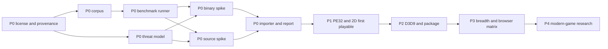

# Browser Porting Toolkit roadmap

## Decision summary

BPTK is feasible as a staged compatibility workbench. The browser building block already exist, and BottleShip now demonstrates a remarkably close binary-runtime architecture. What is not feasible is an unrestricted execution guarantee across arbitrary Windows game, hardware era, middleware, DRM, driver, and network model.

The product should therefore compete on the full porting workflow:

```text
import -> inspect -> choose lane -> adapt -> benchmark -> diagnose -> package -> embed -> publish evidence
```

The differentiator is one workbench joining binary compatibility, source-assisted porting, engine-family adapter, truthful compatibility reporting, and framework-neutral packaging. The P0 decision may lead to collaboration with or adaptation of BottleShip; rebuilding its demonstrated surface without measured cause is not the strategy.

## Current truth

- Initial repository state: empty directory with no git repository, license, runtime, test, or documentation.
- Current repository state: public Apache-2.0 roadmap package, validation harness, and dependency-free `@bygelo/bptk@0.1.0-alpha.0` status and environment-diagnostic CLI.
- Product implementation: BPTK-003 live benchmark and promotion checks, BPTK-007 safe local inspection, BPTK-008 bounded static PE32 mapping, and BPTK-017 live browser graphics probing are implemented but red. A bounded opt-in i386 entry probe is now reachable through `run`, but it is only partial work toward BPTK-009; no guest-execution game-runtime item passes.
- CLI boundary: every literal Surface invocation below is reachable. `legal`, `corpus status`, `security`, `inspect`, `benchmark`, `foundation compare`, `port`, `run`, `import`, `doctor --graphics`, `package`, `compatibility`, and `report` perform bounded local analysis, live self-check, toolchain diagnosis, PE32 image mapping, live browser capability observation, atomic asset packaging, host emission, policy validation, or privacy-minimized reporting without uploading game code. Most input is never executed. Only a PE32 package that explicitly selects `i386_probe_v1`, has zero import and zero TLS callback, and supplies an instruction budget runs the deterministic integer probe locally. Shared `run` surfaces otherwise report the same missing runtime unless a narrower diagnostic option applies.
- Foundation state: legal and security command output explicitly requires named review, corpus status publishes no denominator without approval, foundation comparison measures only locally available options, and source porting reports the missing Emscripten and adapter step without emitting a scaffold. The PE32 mapper bounds header, section, image, relocation, import, TLS, stack, heap, and executable entry-point state; a package may resolve ordinary named and ordinal import to declared static address. The opt-in i386 entry probe supports a bounded integer subset, stack, control flow, flags, ModRM memory access, and self-modification, while import call, TLS callback, x87, full instruction coverage, full exception behavior, Win32 HLE, and any game loop remain blocked. The ephemeral Chrome probe observes WebGL2, WebGL, AudioContext, isolation, SharedArrayBuffer, and renderer state; the current host is degraded because it lacks cross-origin isolation, and this does not prove another browser. The packager emits content-addressed assets atomically plus HTML or React host source against one package identity; no supported game runtime is included. Package integrity timing verifies chunk hash on cold and warm reads but cannot measure a game. Thread, network, and control command validate selection or policy without a worker, network, or input bridge. Engine diagnosis never copies the asset because no approved adapter exists. Compatibility observes installed Chrome, reports installed-but-unprobed Safari and absent Firefox, and never emits a support claim without a runtime. Local report recording is off by default and consent output excludes game content and personal data, but there is no session to reproduce. BPTK-001, BPTK-002, and BPTK-004 remain planned because command output cannot manufacture approval. BPTK-003, BPTK-007, BPTK-008, and BPTK-017 are implemented but red because their prerequisite, approved corpus input, or complete profile remain red. Full source compilation, full i386 conformance, Win32 HLE, browser input, GDI, DirectDraw, game audio, persistence, integrated import, runtime host behavior, and compatibility reproduction are weeks-scale and remain planned.
- Current benchmark coverage: **0 / 45 (0%)**.
- Compatibility corpus coverage: not publishable until BPTK-002 freezes the runtime denominator.
- Closest prior art: BottleShip for unmodified PE32 game; Emscripten for source-assisted game; OpenSA, WebXash, Qwasm2, and ScummVM for engine-family or asset-driven path.

## Product contract

### Minimum promise

BPTK accepts a supported local input form, inspects it without execution, and returns a precise compatibility report. A runnable package is emitted only if its capability path passes an active benchmark.

### First execution target

- DRM-free PE32 and i386 game from the DirectDraw through Direct3D 9 era;
- client-side execution;
- GDI, DirectDraw, selected D3D7/8/9, waveOut or DirectSound, Win32 file and registry behavior;
- WebGPU primary profile with declared WebGL2 fallback where the required feature maps safely;
- local folder, ZIP, BPTK bundle, and explicitly supported installer import;
- plain HTML canvas host plus a thin React lifecycle adapter.

### Early exclusion

- DRM circumvention and kernel anti-cheat;
- kernel driver and arbitrary native device access;
- x86-64 and Direct3D 10–12 outside P4 research;
- server-side native game streaming as a compatibility substitute;
- bundled commercial game executable or asset;
- a title status without toolkit revision and environment evidence.

## Discovery denominator

The raw candidate denominator was frozen after deduplication on 2026-07-18.

| Candidate source | Count | Example signal |
|---|---:|---|
| Initial repository state | 4 | License, implementation, test, and documentation were absent |
| User and product objective | 7 | Broad import, Windows input, browser output, canvas, React host, Maphy ownership, Apple-like workflow |
| Prior-art capability and limitation | 34 | CPU, PE, Win32, DirectX, source toolchain, engine adapter, package, compatibility evidence, browser-runtime and static-recompilation prior art, middleware and copy-protection census, installer, timing, full-motion video, redistributable runtime, source-lane build profile, and engine-family routing |
| Browser, distribution, and security constraint | 14 | GPU availability, thread isolation, socket limit, storage, user content, copyleft, trademark, hostile import, resource exhaustion, and guest containment |
| **Raw** | **59** | Frozen denominator |

| Decision | Count |
|---|---:|
| Accepted into this roadmap | 45 |
| Rejected | 8 |
| Deferred | 5 |
| Implemented | 4 |
| Passing | 0 |

The complete identity, origin, dedupe key, decision, and target mapping is frozen in [the candidate ledger](bench/roadmap/candidate.json); [the rejection and defer ledger](doc/roadmap-rejected.md) explains the non-accepted decisions. A future change may alter the denominator only by adding a newly discovered raw candidate and classifying it in the same change.

## Benchmark contract

Each accepted item now uses one quadruple: **Behavior**, **Surface**, **Benchmark**, and **Tier**. Behavior names what a user gets. Surface is the literal invocation the product must expose; an invocation shown here is a planned contract, not a claim that it exists today. Benchmark names the evidence that protects the behavior. Tier sets how often and how strongly that evidence gates change:

- **Tier 1** — release-blocking regression coverage for a named failure that could silently corrupt, escape, disclose, or invalidate a supported user result;
- **Tier 2** — reserved for a future intermediate gate when a concrete project need justifies it;
- **Tier 3** — the default for planning evidence, bounded research, review, and behavior not yet exposed as a supported product contract.

The specifications under [bench/roadmap/spec](bench/roadmap/README.md) remain acceptance contracts, but `bench/` is not the deliverable. Tier 3 uses a written falsifiable acceptance line only. Tier 1 may use a live or temporary generated check, but no committed baseline, retained-evidence JSON, or golden fixture. A benchmark promotes only the user behavior named in its roadmap row, and command existence cannot satisfy an operational prerequisite. All 33 remain red today; BPTK-003, BPTK-007, BPTK-008, and BPTK-017 are active and implemented, while the other 29 are gate-excluded. [The test contract](doc/TESTING.md) defines promotion.

[bench/roadmap/manifest.json](bench/roadmap/manifest.json) remains the machine-readable source for identity, prerequisite, and promotion state. This roadmap owns the user behavior, literal surface, and benchmark tier.

## Critical path



P0 is a funding and architecture gate. If neither binary option meets the frozen budget, the honest outcome is a source-first toolkit, not an unbounded rewrite.

## P0 — Prove the product and choose the foundation

P0 ends when the legal, evidence, security, binary, source, and import premise is proven on one denominator.

| ID | Behavior | Surface | Benchmark | Source | Tier | Dependency · Owner |
|---|---|---|---|---|---|---|
| BPTK-001 | Know whether a project can be published and which upstream component may be reused | `bptk legal <project>` | [BENCH-001](bench/roadmap/spec/bptk-001.json): returns an approved, revisioned license, provenance, naming, and reuse decision; approval remains open | SRC-001–006/008/009/012–015 | Tier 3 | — · Product + legal |
| BPTK-002 | See compatibility claims against a stable, representative denominator | `bptk corpus status` | [BENCH-002](bench/roadmap/spec/bptk-002.json): freezes lawful fixture, environment profile, and threshold before any percentage is published; corpus review remains open | SRC-002/003/004/006/010/011 | Tier 3 | 001 · Compatibility |
| BPTK-003 | Trust that roadmap status changes only when live evidence passes | `bptk benchmark` | [BENCH-003](bench/roadmap/spec/bptk-003.json): runs deterministic in-memory checks and enforces content-addressed promotion state without retaining a result; passing remains blocked by legal and corpus prerequisite | SRC-002/003/011/013 | **Tier 1** — regression risk: a false-green result promotes unsupported behavior | 001, 002 · Tooling |
| BPTK-004 | Know how an imported game is isolated before opening it | `bptk security <input>` | [BENCH-004](bench/roadmap/spec/bptk-004.json): reviews archive, parser, memory, permission, network, storage, privacy, and hostile-code control; named review remains open | SRC-002/003/009/019/020/023–026 | Tier 3 | 001 · Security |
| BPTK-005 | Get a measured recommendation for the binary-runtime foundation | `bptk foundation compare <input>` | [BENCH-005](bench/roadmap/spec/bptk-005.json): compares adaptation, composition, and new-runtime option on one frozen fixture; no option is selected | SRC-002–005/012/013 | Tier 3 | 001–004 · Runtime |
| BPTK-006 | Turn a supported SDL/OpenGL source project into a runnable browser package | `bptk port --source <project>` | [BENCH-006](bench/roadmap/spec/bptk-006.json): builds from clean source and runs the declared browser profile; no Wasm browser package exists | SRC-006/007/010/016–018 | Tier 3 | 001–004 · Source port |
| BPTK-007 | Drop in a local project and get a safe route or precise blocked reason | `bptk inspect <input>` | [BENCH-007](bench/roadmap/spec/bptk-007.json): classifies folder, archive, installer, PE, source, and engine asset without execution or upload; classifier implemented, prerequisite and full matrix remain red | SRC-002/003/008–011 | **Tier 1** — regression risk: inspection executes input, escapes a path boundary, or selects the wrong lane | 002–006 · Workbench |

### P0 exit gate

- BPTK-001 through BPTK-007 are active and passing.
- One binary option runs the frozen PE32 comparison fixture inside the BPTK-002 budget, or the project explicitly records source-first scope.
- The source fixture builds from a clean checkout and runs in the declared browser profile.
- Invalid and hostile import returns a bounded error without execution, upload, or partial storage.
- The name, license, reuse strategy, and threat model have named reviewer and expiry trigger.

## P1 — Reach a truthful PE32 and 2D first playable

P1 builds the minimum binary path for classic 2D and software-rendered interface. It does not claim broad title support.

| ID | Behavior | Surface | Benchmark | Source | Tier | Dependency · Owner |
|---|---|---|---|---|---|---|
| BPTK-008 | Open an eligible PE32 game into a bounded, correctly resolved memory image | `bptk run <package>` | [BENCH-008](bench/roadmap/spec/bptk-008.json): the product CLI maps section, HIGHLOW relocation, declared named or ordinal import, TLS metadata, stack, heap, and executable entry point deterministically; prerequisite and approved corpus evidence remain red, and no guest instruction executes | SRC-002/003/004 | Tier 3 | 005, 007 · Runtime |
| BPTK-009 | Run supported i386 game code with stable register, FPU, memory, and exception behavior | `bptk run <package>` | [BENCH-009](bench/roadmap/spec/bptk-009.json): a bounded integer entry probe is reachable, but the frozen instruction, FPU, exception, memory, and reference-state suite still cannot pass | SRC-002–005 | **Tier 1** — regression risk: silent CPU divergence changes game state or crashes later in an unrelated subsystem | 005, 008 · Runtime |
| BPTK-010 | Start and keep a supported Win32 game loop running in the browser | `bptk run <package>` | [BENCH-010](bench/roadmap/spec/bptk-010.json): verifies required Kernel32, NTDLL, CRT, synchronization, time, process, memory, and COM behavior; no Win32 HLE exists | SRC-002/003/012/013 | Tier 3 | 009 · Compatibility |
| BPTK-011 | Control a game through browser focus, keyboard, pointer, cursor, timer, and window lifecycle | `bptk run <package>` | [BENCH-011](bench/roadmap/spec/bptk-011.json): replays deterministic USER32 message and input order; no browser bridge exists | SRC-002/003/009 | Tier 3 | 010 · Browser runtime |
| BPTK-012 | See launchers, menus, text, and software-rendered output correctly | `bptk run <package>` | [BENCH-012](bench/roadmap/spec/bptk-012.json): compares GDI image and trace evidence within declared tolerance; no GDI output exists | SRC-003/012 | Tier 3 | 011 · Graphics |
| BPTK-013 | See a supported DirectDraw game render and present a correct 2D frame | `bptk run <package>` | [BENCH-013](bench/roadmap/spec/bptk-013.json): verifies surface, lock, blit, flip, palette, color-key, pitch, and presentation semantics; no browser frame exists | SRC-002/003 | Tier 3 | 010, 011 · Graphics |
| BPTK-014 | Hear supported waveOut and DirectSound audio in sync with play | `bptk run <package>` | [BENCH-014](bench/roadmap/spec/bptk-014.json): checks PCM, buffer, loop, volume, pan, callback, pause, and underrun behavior; no Web Audio bridge exists | SRC-002–004/019/021 | Tier 3 | 010 · Audio |
| BPTK-015 | Save settings and progress across reload without changing the original game files | `bptk run <package> --save <profile>` | [BENCH-015](bench/roadmap/spec/bptk-015.json): temporary checks prove the base stays read-only, no overlay is created, and path-shaped profiles fail; copy-on-write, registry, quota rollback, reload, and OPFS persistence remain unavailable | SRC-002/009/010/022/023 | **Tier 1** — regression risk: a save is lost, aliased to another path, corrupted, or written outside its sandbox | 004, 010 · Storage |
| BPTK-016 | Import a supported package and reach one interactive, persistent 2D session | `bptk import <input> --run` | [BENCH-016](bench/roadmap/spec/bptk-016.json): temporary package diagnosis proves no staging or execution occurs; CPU, Win32, input, graphics, audio, storage, save, reload, and integrated first playable remain unavailable | SRC-002/003/010/022/023 | **Tier 1** — regression risk: individually passing components stop working as one launchable session | 004, 007–015 · Integration |
| BPTK-034 | Service blocking Win32 and synchronous storage over an asynchronous browser API | `bptk run <package>` | [BENCH-034](bench/roadmap/spec/bptk-034.json): a JSPI blocking-call bridge with an Asyncify fallback services synchronous Win32 wait, sleep, and file and OPFS access; no Win32 HLE or storage overlay exists yet, so no blocking call can complete | SRC-030/033 | **Tier 2** — regression risk: a mis-serviced blocking call stalls, deadlocks, or corrupts guest state | 010, 015 · Runtime |
| BPTK-035 | Dispatch, unwind, and vectorize i386 code on a portable WebAssembly 3.0 substrate | `bptk run <package>` | [BENCH-035](bench/roadmap/spec/bptk-035.json): tail-call dispatch, exnref unwinding, and relaxed SIMD run with strict and legacy fallback; only a bounded integer entry probe exists, so the substrate suite cannot pass | SRC-029/031 | **Tier 2** — regression risk: a substrate that assumes one browser feature set loses correctness or performance where it is absent | 009 · Runtime |
| BPTK-037 | Route a title to handle, warn, extract, or refuse from a static middleware and copy-protection census | `bptk inspect <input>` | [BENCH-037](bench/roadmap/spec/bptk-037.json): a signature catalog classifies middleware and copy-protection evidence into a routing decision without executing the input or circumventing any protection; no census exists, so nothing is routed | SRC-033/034 | **Tier 2** — regression risk: a mis-route accepts a protected or unsupported binary as portable or refuses a portable title | 007 · Compatibility |
| BPTK-038 | Extract a supported installer to the game payload without executing it | `bptk import <input>` | [BENCH-038](bench/roadmap/spec/bptk-038.json): unpacks a supported Inno, GOG, or InstallShield cabinet installer and refuses a 16-bit setup stub; no extractor exists | SRC-033/036 | Tier 3 | 007 · Import |
| BPTK-039 | Serve every guest time source from one monotonic clock | `bptk run <package>` | [BENCH-039](bench/roadmap/spec/bptk-039.json): derives QPC, RDTSC, tick, multimedia, and vertical-blank time from one monotonic source with clamped delta; no Win32 HLE exists, so no time source is served | SRC-035 | **Tier 1** — regression risk: divergent clocks slow, double-speed, or busy-spin the game and desync audio and physics | 010 · Runtime |
| BPTK-040 | Play supported full-motion-video middleware in sync with the game | `bptk run <package>` | [BENCH-040](bench/roadmap/spec/bptk-040.json): decodes supported Bink, Smacker, and VP6 through the browser frame and audio and refuses a proprietary WMV or Indeo bitstream; no frame or audio bridge exists | SRC-033/037 | Tier 3 | 013, 014 · Graphics |
| BPTK-041 | Provide the redistributable runtime a supported game expects | `bptk run <package>` | [BENCH-041](bench/roadmap/spec/bptk-041.json): resolves an exact D3DX, XInput, XAudio, CRT, VB6, and DirectMusic instrument dependency from a redistributable-only kit and reports an unmet one; no Win32 HLE exists | SRC-038 | Tier 3 | 010 · Runtime |
| BPTK-044 | Bound extraction, streaming, and execution against resource exhaustion | `bptk import <input>` | [BENCH-044](bench/roadmap/spec/bptk-044.json): refuses a decompression-bomb, deep-nesting, and quota-exhaustion fixture at a declared bound while admitting a legitimate large game; no enforcement layer exists | SRC-041 | **Tier 1** — regression risk: an unbounded extraction or execution path is a denial-of-service and quota-exhaustion vector | 004 · Security |
| BPTK-045 | Contain guest execution to a policy that cannot reach host capability | `bptk run <package>` | [BENCH-045](bench/roadmap/spec/bptk-045.json): refuses a guest attempt to reach host script, out-of-sandbox storage, or unmediated network; no guest runtime exists | SRC-024 | **Tier 1** — regression risk: a containment gap turns an imported game into a host-compromise or data-exfiltration vector | 004 · Security |

### P1 exit gate

- The synthetic PE32 2D fixture reaches `interactive` with correct visual, input, audio, and API artifact.
- Save and registry mutation survive reload without modifying the read-only base.
- Malformed executable and package corpus fail closed under resource limit.
- One user-owned, metadata-only pilot may be evaluated locally, but its asset is not retained or published and its status is not generalized.

## P2 — Deliver Direct3D 9, source SDK, performance, and package output

P2 produces the first package that demonstrates the product’s Windows-to-browser value across both binary and source lane.

| ID | Behavior | Surface | Benchmark | Source | Tier | Dependency · Owner |
|---|---|---|---|---|---|---|
| BPTK-017 | Know whether this browser can run the package, use a safe fallback, or must block | `bptk doctor --graphics` | [BENCH-017](bench/roadmap/spec/bptk-017.json): live ephemeral Chrome probe observes WebGPU, WebGL2, WebGL, audio, isolation, shared memory, fallback, and reason-bound blocking; prerequisite and complete browser profile remain red | SRC-002/007/014–016/020 | Tier 3 | 003, 004 · Graphics |
| BPTK-018 | Play supported D3D7/8 fixed-function content on the selected browser GPU path | `bptk run <package>` | [BENCH-018](bench/roadmap/spec/bptk-018.json): compares legacy state, transform, resource, cache, and presentation behavior; no GPU translator exists | SRC-002/007/014 | Tier 3 | 013, 017 · Graphics |
| BPTK-019 | Play supported D3D9 fixed-function content through device loss and reset | `bptk run <package>` | [BENCH-019](bench/roadmap/spec/bptk-019.json): verifies resource, state block, target, scene, loss, reset, restoration, and teardown; no D3D9 device path exists | SRC-002/007/014 | Tier 3 | 018 · Graphics |
| BPTK-020 | Render supported D3D9 shader-model 1–3 content correctly and deterministically | `bptk run <package>` | [BENCH-020](bench/roadmap/spec/bptk-020.json): validates bytecode, IR, reflection, cache, precision, control flow, resource, and frame result; no translator or compiler exists | SRC-001/002/014/015/020 | **Tier 1** — regression risk: a backend-specific shader miscompile silently renders the wrong game state | 019 · Shader |
| BPTK-021 | Port a supported native source project reproducibly with a documented adapter SDK | `bptk port --source <project>` | [BENCH-021](bench/roadmap/spec/bptk-021.json): reproduces toolchain, adapter, diagnostic, package, and browser result in a clean second environment; no SDK exists | SRC-006/007/010/016 | Tier 3 | 006, 017 · Source port |
| BPTK-042 | Build a supported source tree to the browser under a pinned Emscripten profile | `bptk port --source <project>` | [BENCH-042](bench/roadmap/spec/bptk-042.json): a pinned profile sets isolation, threads, native exception, SIMD, and JSPI-driven OPFS and builds deterministically; no toolchain integration exists | SRC-033/039 | Tier 3 | 006 · Source port |
| BPTK-022 | Start a large game reliably with verified, resumable, offline-capable asset delivery | `bptk package <project> --asset-mode stream` | [BENCH-022](bench/roadmap/spec/bptk-022.json): content-addressed chunk output and atomic package commit exist; browser resume, corruption recovery, quota, eviction, startup, memory, and offline runtime behavior remain red | SRC-002/006/010/022 | Tier 3 | 015–017 · Asset pipeline |
| BPTK-023 | See whether a package meets its declared startup, frame, audio, CPU, and memory budget | `bptk benchmark <package> --profile performance` | [BENCH-023](bench/roadmap/spec/bptk-023.json): verifies content-addressed chunk integrity on cold and warm reads; startup, frame, audio, guest CPU, runtime memory, correctness, and variance remain unavailable without a game runtime | SRC-002–005/013/014 | Tier 3 | 009, 010, 018 · Performance |
| BPTK-024 | Embed the same package in plain HTML or React without changing runtime behavior | `bptk package <project> --host <html&#124;react>` | [BENCH-024](bench/roadmap/spec/bptk-024.json): HTML and React source preserve one content-addressed asset package identity; actual runtime lifecycle, CSP, remount, teardown, and game-loop ownership remain red | SRC-001/002/006/009/010/020/023/024 | **Tier 1** — regression risk: a host remount duplicates the game loop, leaks a worker, or changes package behavior | 016, 017, 021 · Packaging |

### P2 exit gate

- The D3D9 fixed-function and shader fixture passes on the primary GPU profile; fallback behavior is explicit.
- The source SDK is reproduced by a clean second environment.
- The binary and source output share one package and lifecycle contract.
- Plain HTML and React host produce the same runtime artifact, and React never owns the game loop.
- The frozen desktop fixture meets the BPTK-002 performance budget with artifact retained.

## P3 — Expand browser, control, network, evidence, and engine breadth

P3 turns the first package into an externally testable platform without weakening compatibility truth.

| ID | Behavior | Surface | Benchmark | Source | Tier | Dependency · Owner |
|---|---|---|---|---|---|---|
| BPTK-025 | Run the correct threaded or single-thread package for the current host | `bptk package <project> --thread <auto&#124;on&#124;off>` | [BENCH-025](bench/roadmap/spec/bptk-025.json): live isolation and SharedArrayBuffer observation selects off for auto, blocks forced on when unavailable, and writes configuration atomically; no worker-backed package exists | SRC-002/006/018/019/024 | Tier 3 | 021, 024 · Browser runtime |
| BPTK-026 | Connect a game only through a consented, allowlisted browser transport or disclosed proxy | `bptk run <package> --network <off&#124;prompt>` | [BENCH-026](bench/roadmap/spec/bptk-026.json): temporary checks prove off denies with zero attempt and prompt requires consent with zero attempt; transport, reconnect, loss, latency, proxy, and runtime mediation remain unavailable | SRC-006/010/017 | **Tier 1** — regression risk: a package connects or uploads without consent or outside its endpoint allowlist | 004, 010, 021, 024 · Network |
| BPTK-027 | Play with keyboard, pointer, controller, fullscreen, touch, remap, accessible controls, and safe exit | `bptk run <package> --control <profile>` | [BENCH-027](bench/roadmap/spec/bptk-027.json): validates the default or local JSON logical-action profile; no browser input, focus, fullscreen, touch, remap-persistence, accessibility, or safe-exit observation exists | SRC-001/009/010/025–028 | Tier 3 | 011, 024 · Experience |
| BPTK-028 | Reproduce a compatibility result without sharing the game or personal data | `bptk report <package> --record <off&#124;consent>` | [BENCH-028](bench/roadmap/spec/bptk-028.json): off writes nothing and consent writes a minimized local package/environment report without game or personal data; runtime replay, crash, screenshot, provenance expiry, and second-environment reproduction remain red | SRC-002/003/011/013 | **Tier 1** — regression risk: a report leaks proprietary content or personal data, or replays against stale revisions | 002, 003, 007, 024 · Compatibility |
| BPTK-029 | Use a supported engine-family adapter with user-owned asset kept separate | `bptk port --engine <engine> <asset>` | [BENCH-029](bench/roadmap/spec/bptk-029.json): safely classifies the local asset, copies nothing, and reports missing rights attestation and adapter approval; no adapter, save, mod, input, network, or runtime contract exists | SRC-008–011 | Tier 3 | 001, 003, 007, 021, 024 · Adapter |
| BPTK-043 | Route a supported game to a matching open engine reimplementation | `bptk inspect <input>` | [BENCH-043](bench/roadmap/spec/bptk-043.json): fingerprints the engine family and routes to a matching open reimplementation or reports no match, bundling no code; no engine census exists | SRC-033/040 | **Tier 2** — regression risk: a wrong engine match wastes adapter effort and misleads the compatibility decision | 029 · Adapter |
| BPTK-030 | Know whether the same package is supported, degraded, or blocked in each declared browser | `bptk compatibility <package> --browser <profile>` | [BENCH-030](bench/roadmap/spec/bptk-030.json): live Chrome capability is observed, Safari is installed but not automated, and absent Firefox blocks precisely; no package runtime or browser support claim exists | SRC-003/009/016/018–028 | Tier 3 | 017, 024, 025, 027 · Quality |

### P3 exit gate

- Every required browser profile is supported, degraded, or blocked exactly as declared.
- Threaded deployment fails explicitly when cross-origin isolation is missing and selects the correct package otherwise.
- Network access requires consent and an allowlisted endpoint; offline behavior is deterministic.
- Compatibility observation can be reproduced without sharing proprietary content or personal data.
- One engine-family adapter passes while preserving separation between open engine and user-owned asset.

## P4 — Research modern-game expansion without promising it

P4 is evidence generation. Each item must result in a bounded implementation proposal, continued defer, or rejection.

| ID | Behavior | Surface | Benchmark | Source | Tier | Dependency · Owner |
|---|---|---|---|---|---|---|
| BPTK-031 | Learn whether an x86-64 game has a credible browser execution path | `bptk inspect <input> --target x86_64` | [BENCH-031](bench/roadmap/spec/bptk-031.json): observes input architecture and live browser memory64 support, then defers because no x86-64 CPU, exception, address-space, JIT, performance, or migration prototype exists | SRC-002/004/005/013/019 | Tier 3 | 023, 030 · Runtime research |
| BPTK-032 | Learn whether a D3D10/11 game has a credible WebGPU translation path | `bptk inspect <input> --target d3d11` | [BENCH-032](bench/roadmap/spec/bptk-032.json): scans bounded input for DXGI, D3D11, and DXBC signal and observes live WebGPU availability, then defers because no resource, shader, or synchronization translator exists | SRC-001/013/014/020 | Tier 3 | 020, 023, 030 · Graphics research |
| BPTK-033 | Get an evidence-backed stop, defer, or next-step decision for a modern game | `bptk inspect <input> --target modern` | [BENCH-033](bench/roadmap/spec/bptk-033.json): combines bounded modern-API signal with live WebGPU and memory64 observation, then defers because prerequisite runtime research and a D3D12 or Vulkan-era mapping are absent | SRC-001/013–015/020 | Tier 3 | 030–032 · Architecture research |
| BPTK-036 | Learn whether per-title static recompilation to WebAssembly is a viable fourth lane | `bptk foundation compare <input>` | [BENCH-036](bench/roadmap/spec/bptk-036.json): compares a static machine-code to WebAssembly pipeline against the binary and source lane, then defers because the comparative spike and a per-title pipeline are absent | SRC-032/033 | Tier 3 | 005 · Architecture research |

### P4 exit gate

- Each report pins current browser and upstream revision and includes a reproducible prototype of the highest-risk gap.
- Promotion creates a new bounded implementation item and benchmark; research text alone cannot expand the support surface.
- A negative result is acceptable and preferred over a non-evidenced compatibility promise.

## Go, narrow, or stop decision

After P0, Maphy Technologies should make one explicit decision:

| Decision | Evidence condition | Consequence |
|---|---|---|
| Go, dual lane | Binary and source spike both pass within budget | Continue P1 binary and P2 source SDK in parallel |
| Narrow, source-first | Source passes; no legally usable binary option meets budget | Build workbench, analyzer, source SDK, package, and engine adapter; keep binary lane research-only |
| Narrow, classic binary | Binary passes; source UX is not differentiated | Focus PE32 through D3D9 and integrate existing source toolchain rather than own it |
| Stop runtime build | Neither spike meets the frozen correctness and performance budget | Publish the audit and avoid funding an unbounded compatibility rewrite |

## Risk register

| Risk | Leading indicator | Mitigation | Stop condition |
|---|---|---|---|---|---|---|
| BottleShip already occupies the binary niche | Its compatibility and contributor base outpace BPTK | Collaborate, contribute, fork only with differentiation, or focus workbench/source lane | BPTK adds no measurable user value beyond a rename |
| License graph blocks desired distribution | Core option requires incompatible copyleft or proprietary component | Decide license before code, isolate process boundary where valid, retain notice and source offer | No compliant combined architecture exists |
| Compatibility surface grows title by title | Missing API count rises without generic convergence | Corpus stratification, generic benchmark, reusable quirk policy, rejection ledger | P1 pilot needs pervasive title patch |
| Browser performance misses playability | CPU, frame, audio, memory, or startup budget fails repeatedly | Profile early, reuse proven JIT, reduce scope, source lane | No option meets BPTK-002 budget after P0 spike |
| WebGPU or thread deployment narrows reach | Required profile fails on a target browser | WebGL2 or single-thread profile where behavior is correct; explicit support floor | Required title class depends on unavailable feature with no safe fallback |
| User import creates security exposure | Parser crash, origin escape, network leak, or quota abuse | Threat model before importer, bounded parser, local-first, deny network by default | Critical boundary lacks a testable control |
| Asset and game rights are conflated with open engine code | Package or fixture includes restricted content | User-supplied local asset, separate distribution state, rights audit | Required public fixture cannot be lawfully distributed |
| Public name creates Apple confusion | User or press treats BPTK as Apple-affiliated | Independent brand and legal review before launch | Counsel finds unacceptable confusion risk |

## Documentation synchronization rule

When an item changes state, update all affected truth in one change:

- `bench/roadmap/manifest.json` and the owning benchmark spec;
- ROADMAP.md count, tier row, and exit gate;
- README.md current state and compatibility boundary;
- doc/TESTING.md gate command and coverage;
- doc/ARCHITECTURE.md if the component or lane changes;
- doc/legal-boundary.md and doc/source-audit.md when upstream or distribution state changes;
- CHANGELOG.md with the user-visible or engineering outcome.

Run `python3 tool/validate.py` before claiming the roadmap package is synchronized.
