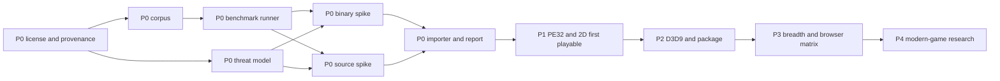

# Browser Porting Toolkit roadmap

## Decision summary

BPTK is feasible as a staged compatibility workbench. The browser building block already exist, and BottleShip now demonstrates a remarkably close binary-runtime architecture. What is not feasible is an unrestricted execution guarantee across arbitrary Windows game, hardware era, middleware, DRM, driver, and network model.

The product should therefore compete on the full porting workflow:

```text
import -> inspect -> choose lane -> adapt -> benchmark -> diagnose -> package -> embed -> publish evidence
```

The differentiator is one workbench joining binary compatibility, source-assisted porting, engine-family adapter, truthful compatibility reporting, and framework-neutral packaging. The P0 decision may lead to collaboration with or adaptation of BottleShip; rebuilding its demonstrated surface without measured cause is not the strategy.

## Current truth

- Initial repository state: empty directory with no git repository, license, runtime, test, or documentation.
- Current repository state: public Apache-2.0 roadmap package, validation harness, and dependency-free `@bygelo/bptk@0.1.0-alpha.0` status and environment-diagnostic CLI.
- Product implementation: 0 item.
- CLI boundary: `status` and `doctor` do not import, inspect, transform, execute, or test a game and do not promote a roadmap item.
- Current benchmark coverage: **0 / 33 (0%)**.
- Compatibility corpus coverage: not publishable until BPTK-002 freezes the runtime denominator.
- Closest prior art: BottleShip for unmodified PE32 game; Emscripten for source-assisted game; OpenSA, WebXash, Qwasm2, and ScummVM for engine-family or asset-driven path.

## Product contract

### Minimum promise

BPTK accepts a supported local input form, inspects it without execution, and returns a precise compatibility report. A runnable package is emitted only if its capability path passes an active benchmark.

### First execution target

- DRM-free PE32 and i386 game from the DirectDraw through Direct3D 9 era;
- client-side execution;
- GDI, DirectDraw, selected D3D7/8/9, waveOut or DirectSound, Win32 file and registry behavior;
- WebGPU primary profile with declared WebGL2 fallback where the required feature maps safely;
- local folder, ZIP, BPTK bundle, and explicitly supported installer import;
- plain HTML canvas host plus a thin React lifecycle adapter.

### Early exclusion

- DRM circumvention and kernel anti-cheat;
- kernel driver and arbitrary native device access;
- x86-64 and Direct3D 10–12 outside P4 research;
- server-side native game streaming as a compatibility substitute;
- bundled commercial game executable or asset;
- a title status without toolkit revision and environment evidence.

## Discovery denominator

The raw candidate denominator was frozen after deduplication on 2026-07-18.

| Candidate source | Count | Example signal |
|---|---:|---|
| Initial repository state | 4 | License, implementation, test, and documentation were absent |
| User and product objective | 7 | Broad import, Windows input, browser output, canvas, React host, Maphy ownership, Apple-like workflow |
| Prior-art capability and limitation | 23 | CPU, PE, Win32, DirectX, source toolchain, engine adapter, package, compatibility evidence |
| Browser, distribution, and security constraint | 12 | GPU availability, thread isolation, socket limit, storage, user content, copyleft, trademark, hostile import |
| **Raw** | **46** | Frozen denominator |

| Decision | Count |
|---|---:|
| Accepted into this roadmap | 33 |
| Rejected | 8 |
| Deferred | 5 |
| Implemented | 0 |
| Passing | 0 |

The complete identity, origin, dedupe key, decision, and target mapping is frozen in [the candidate ledger](bench/roadmap/candidate.json); [the rejection and defer ledger](doc/roadmap-rejected.md) explains the non-accepted decisions. A future change may alter the denominator only by adding a newly discovered raw candidate and classifying it in the same change.

## Benchmark contract

Every accepted item has one prewritten specification under [bench/roadmap/spec](bench/roadmap/README.md). Runtime behavior has a future acceptance specification that becomes executable only when its runner and fixture land. Legal, research, architecture, and governance outcome use an evidence check with explicit review criterion. All are red and gate-excluded today; [the test contract](doc/TESTING.md) defines mechanical promotion.

The machine-readable source of truth is [bench/roadmap/manifest.json](bench/roadmap/manifest.json).

## Critical path



P0 is a funding and architecture gate. If neither binary option meets the frozen budget, the honest outcome is a source-first toolkit, not an unbounded rewrite.

## P0 — Prove the product and choose the foundation

P0 ends when the legal, evidence, security, binary, source, and import premise is proven on one denominator.

| ID | Outcome | Dependency | Benchmark and present failure | Source | Primary risk | Proposed owner |
|---|---|---|---|---|---|---|
| BPTK-001 | Approve Apache-2.0 outbound posture, upstream reuse, provenance, and public-name path | — | [BENCH-001](bench/roadmap/spec/bptk-001.json): runtime graph and name review remain open | SRC-001–006/008/009/012–015 | Late license conflict forces redesign | Product + legal |
| BPTK-002 | Freeze representative synthetic, redistributable, and metadata-only compatibility corpus | 001 | [BENCH-002](bench/roadmap/spec/bptk-002.json): runtime denominator absent | SRC-002/003/004/006/010/011 | Biased corpus rewards one-off compatibility | Compatibility |
| BPTK-003 | Implement deterministic benchmark runner, artifact retention, and promotion gate | 001, 002 | [BENCH-003](bench/roadmap/spec/bptk-003.json): no product runner | SRC-002/003/011/013 | Flaky evidence makes status meaningless | Tooling |
| BPTK-004 | Approve hostile-import threat model and abuse-case plan | 001 | [BENCH-004](bench/roadmap/spec/bptk-004.json): no reviewed threat model | SRC-002/003/009/019/020/023–026 | Local file and origin compromise | Security |
| BPTK-005 | Compare BottleShip adaptation, permissive composition, and new binary runtime | 001–004 | [BENCH-005](bench/roadmap/spec/bptk-005.json): no option measured by BPTK | SRC-002–005/012/013 | Rebuilding prior art consumes the project | Runtime |
| BPTK-006 | Compile, package, and run the source-assisted SDL/OpenGL spike | 001–004 | [BENCH-006](bench/roadmap/spec/bptk-006.json): no BPTK source package | SRC-006/007/010/016–018 | Toolchain demo hides porting cost | Source port |
| BPTK-007 | Safely classify import into binary, source, engine, or blocked report | 002–006 | [BENCH-007](bench/roadmap/spec/bptk-007.json): no importer or report | SRC-002/003/008–011 | Parser attack or misleading route | Workbench |

### P0 exit gate

- BPTK-001 through BPTK-007 are active and passing.
- One binary option runs the frozen PE32 comparison fixture inside the BPTK-002 budget, or the project explicitly records source-first scope.
- The source fixture builds from a clean checkout and runs in the declared browser profile.
- Invalid and hostile import returns a bounded error without execution, upload, or partial storage.
- The name, license, reuse strategy, and threat model have named reviewer and expiry trigger.

## P1 — Reach a truthful PE32 and 2D first playable

P1 builds the minimum binary path for classic 2D and software-rendered interface. It does not claim broad title support.

| ID | Outcome | Dependency | Benchmark and present failure | Source | Primary risk | Proposed owner |
|---|---|---|---|---|---|---|
| BPTK-008 | Map PE32 section, relocation, import, TLS, stack, heap, and entry point | 005, 007 | [BENCH-008](bench/roadmap/spec/bptk-008.json): no loader | SRC-002/003/004 | Malformed image corrupts memory | Runtime |
| BPTK-009 | Execute the frozen i386 instruction and exception baseline | 005, 008 | [BENCH-009](bench/roadmap/spec/bptk-009.json): no CPU core selected | SRC-002–005 | Rare instruction and FPU divergence | Runtime |
| BPTK-010 | Implement measured Kernel32, NTDLL, CRT, synchronization, time, and COM behavior | 009 | [BENCH-010](bench/roadmap/spec/bptk-010.json): startup stops on core API | SRC-002/003/012/013 | Behavioral edge case exceeds API checklist | Compatibility |
| BPTK-011 | Map USER32 window, message, focus, timer, keyboard, pointer, and cursor to browser behavior | 010 | [BENCH-011](bench/roadmap/spec/bptk-011.json): no logical window or input bridge | SRC-002/003/009 | Gesture and event ordering mismatch | Browser runtime |
| BPTK-012 | Render the GDI corpus with image and trace evidence | 011 | [BENCH-012](bench/roadmap/spec/bptk-012.json): no GDI output | SRC-003/012 | Font and raster variance | Graphics |
| BPTK-013 | Implement DirectDraw surface, lock, blit, flip, palette, and presentation | 010, 011 | [BENCH-013](bench/roadmap/spec/bptk-013.json): no 2D frame | SRC-002/003 | Legacy pitch and palette semantics | Graphics |
| BPTK-014 | Bridge waveOut and DirectSound to WebAudio or AudioWorklet | 010 | [BENCH-014](bench/roadmap/spec/bptk-014.json): no verified audio | SRC-002–004/019/021 | Autoplay, timing, and underrun | Audio |
| BPTK-015 | Persist a read-only virtual drive plus file, registry, and OPFS overlay | 004, 010 | [BENCH-015](bench/roadmap/spec/bptk-015.json): no safe save state | SRC-002/009/010/022/023 | Path mismatch, quota, and corruption | Storage |
| BPTK-016 | Import local package and prove one integrated 2D interactive and reload scenario | 004, 007–015 | [BENCH-016](bench/roadmap/spec/bptk-016.json): no package staging or integrated first playable | SRC-002/003/010/022/023 | Archive failure or cross-component mismatch | Integration |

### P1 exit gate

- The synthetic PE32 2D fixture reaches `interactive` with correct visual, input, audio, and API artifact.
- Save and registry mutation survive reload without modifying the read-only base.
- Malformed executable and package corpus fail closed under resource limit.
- One user-owned, metadata-only pilot may be evaluated locally, but its asset is not retained or published and its status is not generalized.

## P2 — Deliver Direct3D 9, source SDK, performance, and package output

P2 produces the first package that demonstrates the product’s Windows-to-browser value across both binary and source lane.

| ID | Outcome | Dependency | Benchmark and present failure | Source | Primary risk | Proposed owner |
|---|---|---|---|---|---|---|
| BPTK-017 | Probe and declare WebGPU primary, WebGL2 fallback, limit, and degradation profile | 003, 004 | [BENCH-017](bench/roadmap/spec/bptk-017.json): no supported GPU classification | SRC-002/007/014–016/020 | Browser and driver capability variance | Graphics |
| BPTK-018 | Translate D3D7/8 fixed-function state to the selected GPU profile | 013, 017 | [BENCH-018](bench/roadmap/spec/bptk-018.json): no early-3D frame | SRC-002/007/014 | State combination and legacy default | Graphics |
| BPTK-019 | Translate D3D9 fixed-function, resource, state block, target, and reset | 018 | [BENCH-019](bench/roadmap/spec/bptk-019.json): no D3D9 fixed-function frame | SRC-002/007/014 | Caps, format, and lost-device behavior | Graphics |
| BPTK-020 | Translate D3D9 shader model 1–3 bytecode with validation and cache | 019 | [BENCH-020](bench/roadmap/spec/bptk-020.json): no valid browser shader | SRC-001/002/014/015/020 | Precision and backend-specific miscompile | Shader |
| BPTK-021 | Publish a reproducible Emscripten source adapter SDK | 006, 017 | [BENCH-021](bench/roadmap/spec/bptk-021.json): source spike remains one-off | SRC-006/007/010/016 | Build diversity defeats the template | Source port |
| BPTK-022 | Package, stream, verify, cache, resume, and store large asset | 015–017 | [BENCH-022](bench/roadmap/spec/bptk-022.json): no bounded large-asset startup | SRC-002/006/010/022 | Quota, eviction, integrity, and startup | Asset pipeline |
| BPTK-023 | Meet frozen startup, CPU, frame, audio, memory, and code-cache budget | 009, 010, 018 | [BENCH-023](bench/roadmap/spec/bptk-023.json): no BPTK runtime to profile | SRC-002–005/013/014 | Optimization trades correctness for speed | Performance |
| BPTK-024 | Prove binary and source output share one static package, HTML host, and thin React lifecycle adapter | 016, 017, 021 | [BENCH-024](bench/roadmap/spec/bptk-024.json): no shared deployable package contract | SRC-001/002/006/009/010/020/023/024 | CSP, path, worker, header, and remount | Packaging |

### P2 exit gate

- The D3D9 fixed-function and shader fixture passes on the primary GPU profile; fallback behavior is explicit.
- The source SDK is reproduced by a clean second environment.
- The binary and source output share one package and lifecycle contract.
- Plain HTML and React host produce the same runtime artifact, and React never owns the game loop.
- The frozen desktop fixture meets the BPTK-002 performance budget with artifact retained.

## P3 — Expand browser, control, network, evidence, and engine breadth

P3 turns the first package into an externally testable platform without weakening compatibility truth.

| ID | Outcome | Dependency | Benchmark and present failure | Source | Primary risk | Proposed owner |
|---|---|---|---|---|---|---|
| BPTK-025 | Ship separate threaded and single-thread profile with COOP/COEP selection | 021, 024 | [BENCH-025](bench/roadmap/spec/bptk-025.json): no shared-memory package | SRC-002/006/018/019/024 | Hosting header and worker constraint | Browser runtime |
| BPTK-026 | Mediate network through allowed browser transport or explicit proxy | 004, 010, 021, 024 | [BENCH-026](bench/roadmap/spec/bptk-026.json): no browser-permitted transport | SRC-006/010/017 | Protocol semantics, privacy, and relay cost | Network |
| BPTK-027 | Complete controller, fullscreen, touch, remap, focus, accessibility, and safe exit | 011, 024 | [BENCH-027](bench/roadmap/spec/bptk-027.json): incomplete control path | SRC-001/009/010/025–028 | Gesture and reserved shortcut conflict | Experience |
| BPTK-028 | Store revisioned environment, replay, crash, and compatibility artifact | 002, 003, 007, 024 | [BENCH-028](bench/roadmap/spec/bptk-028.json): observation cannot be reproduced | SRC-002/003/011/013 | Privacy and stale status | Compatibility |
| BPTK-029 | Publish an engine-family adapter contract and one rights-approved fixture adapter | 001, 003, 007, 021, 024 | [BENCH-029](bench/roadmap/spec/bptk-029.json): engine port remains one-off | SRC-008–011 | Asset-right confusion and core fragmentation | Adapter |
| BPTK-030 | Pass declared Chrome, Edge, Firefox, Safari, and selected mobile profile | 017, 024, 025, 027 | [BENCH-030](bench/roadmap/spec/bptk-030.json): no browser support floor | SRC-003/009/016/018–028 | Web standard and driver variance | Quality |

### P3 exit gate

- Every required browser profile is supported, degraded, or blocked exactly as declared.
- Threaded deployment fails explicitly when cross-origin isolation is missing and selects the correct package otherwise.
- Network access requires consent and an allowlisted endpoint; offline behavior is deterministic.
- Compatibility observation can be reproduced without sharing proprietary content or personal data.
- One engine-family adapter passes while preserving separation between open engine and user-owned asset.

## P4 — Research modern-game expansion without promising it

P4 is evidence generation. Each item must result in a bounded implementation proposal, continued defer, or rejection.

| ID | Outcome | Dependency | Benchmark and present failure | Source | Primary risk | Proposed owner |
|---|---|---|---|---|---|---|
| BPTK-031 | Decide x86-64 execution, address-space, memory64, JIT, and migration path | 023, 030 | [BENCH-031](bench/roadmap/spec/bptk-031.json): no measured 64-bit architecture | SRC-002/004/005/013/019 | Browser memory and CPU model invalidates PE32 design | Runtime research |
| BPTK-032 | Prototype and map DXGI, D3D10/11, DXBC, resource, shader, and sync gap | 020, 023, 030 | [BENCH-032](bench/roadmap/spec/bptk-032.json): no credible D3D10/11 WebGPU path | SRC-001/013/014/020 | Vulkan assumption does not map to WebGPU | Graphics research |
| BPTK-033 | Compare D3D12 and Vulkan-era requirement with current WebGPU and x86-64 result | 030–032 | [BENCH-033](bench/roadmap/spec/bptk-033.json): no modern-API mapping demonstrated | SRC-001/013–015/020 | Gap remains architectural and uneconomic | Architecture research |

### P4 exit gate

- Each report pins current browser and upstream revision and includes a reproducible prototype of the highest-risk gap.
- Promotion creates a new bounded implementation item and benchmark; research text alone cannot expand the support surface.
- A negative result is acceptable and preferred over a non-evidenced compatibility promise.

## Go, narrow, or stop decision

After P0, Maphy Technologies should make one explicit decision:

| Decision | Evidence condition | Consequence |
|---|---|---|
| Go, dual lane | Binary and source spike both pass within budget | Continue P1 binary and P2 source SDK in parallel |
| Narrow, source-first | Source passes; no legally usable binary option meets budget | Build workbench, analyzer, source SDK, package, and engine adapter; keep binary lane research-only |
| Narrow, classic binary | Binary passes; source UX is not differentiated | Focus PE32 through D3D9 and integrate existing source toolchain rather than own it |
| Stop runtime build | Neither spike meets the frozen correctness and performance budget | Publish the audit and avoid funding an unbounded compatibility rewrite |

## Risk register

| Risk | Leading indicator | Mitigation | Stop condition |
|---|---|---|---|
| BottleShip already occupies the binary niche | Its compatibility and contributor base outpace BPTK | Collaborate, contribute, fork only with differentiation, or focus workbench/source lane | BPTK adds no measurable user value beyond a rename |
| License graph blocks desired distribution | Core option requires incompatible copyleft or proprietary component | Decide license before code, isolate process boundary where valid, retain notice and source offer | No compliant combined architecture exists |
| Compatibility surface grows title by title | Missing API count rises without generic convergence | Corpus stratification, generic benchmark, reusable quirk policy, rejection ledger | P1 pilot needs pervasive title patch |
| Browser performance misses playability | CPU, frame, audio, memory, or startup budget fails repeatedly | Profile early, reuse proven JIT, reduce scope, source lane | No option meets BPTK-002 budget after P0 spike |
| WebGPU or thread deployment narrows reach | Required profile fails on a target browser | WebGL2 or single-thread profile where behavior is correct; explicit support floor | Required title class depends on unavailable feature with no safe fallback |
| User import creates security exposure | Parser crash, origin escape, network leak, or quota abuse | Threat model before importer, bounded parser, local-first, deny network by default | Critical boundary lacks a testable control |
| Asset and game rights are conflated with open engine code | Package or fixture includes restricted content | User-supplied local asset, separate distribution state, rights audit | Required public fixture cannot be lawfully distributed |
| Public name creates Apple confusion | User or press treats BPTK as Apple-affiliated | Independent brand and legal review before launch | Counsel finds unacceptable confusion risk |

## Documentation synchronization rule

When an item changes state, update all affected truth in one change:

- `bench/roadmap/manifest.json` and the owning benchmark spec;
- ROADMAP.md count, tier row, and exit gate;
- README.md current state and compatibility boundary;
- doc/TESTING.md gate command and coverage;
- doc/ARCHITECTURE.md if the component or lane changes;
- doc/legal-boundary.md and doc/source-audit.md when upstream or distribution state changes;
- CHANGELOG.md with the user-visible or engineering outcome.

Run `python3 tool/validate.py` before claiming the roadmap package is synchronized.
