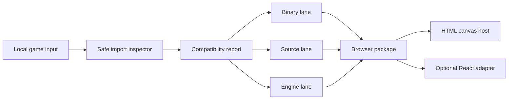
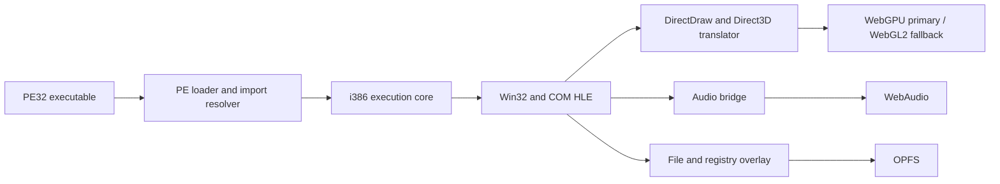

# Architecture

## Status

This document describes the target architecture, not implemented software. Every component below remains planned until its roadmap benchmark is promoted to the active gate and passes.

## Repository tooling boundary

The published `@bygelo/bptk@0.1.0-alpha.0` package is control-plane metadata, not an implementation of this target architecture. Its `status` command reads a bundled, revisioned roadmap snapshot, and its `doctor` command reports objective Node.js and operating-system facts. It has no importer, PE loader, CPU core, Win32 shim, graphics translator, browser host, game-content reader, or compatibility runner.

Publishing that bounded CLI does not promote any roadmap item: implementation and passing coverage remain 0 / 33. A future runtime must enter through the benchmark promotion rule rather than expanding the CLI by implication.

## Product boundary

BPTK is a developer workbench and a browser runtime family. It is not one universal transpiler. Its first responsibility is to classify an import and select a viable lane:

The report is a valid terminal output. Unsupported input must fail closed with a machine-readable reason instead of crashing, uploading content, or pretending to produce a port.

## Shared workbench

All lane share a planned control plane:

- **Importer**: reads local folder, archive, selected installer, executable, source tree, and engine asset without executing imported code.
- **Inspector**: identifies PE architecture, import table, graphics API, middleware hint, asset format, source build system, required browser capability, and known blocker.
- **Planner**: selects binary, source, engine, or unsupported state and produces ordered remediation.
- **Benchmark runner**: executes synthetic and redistributable fixture and records deterministic artifact.
- **Packager**: emits a static browser package plus plain HTML and optional React adapter.
- **Compatibility catalog**: stores observed capability and provenance, never unsupported “works” assertion.

## Binary lane

The binary lane is the closest analogue to Apple’s evaluation environment, adapted to browser constraints:

The P0 architecture spike compares three concrete option:

1. Adapt or collaborate with BottleShip, retaining its Apache-2.0 and third-party notice obligations.
2. Compose a smaller runtime from permissive component such as v86 and independently implemented HLE layer.
3. Build a new runtime only where a measured requirement or license boundary rules out reuse.

The decision record must measure compatibility, performance, maintainability, browser reach, license effect, and upstream relationship. A clean rewrite is not the default.

P1 component work is not complete merely because isolated PE, CPU, API, graphics, audio, and storage fixture pass. BPTK-016 owns one integrated synthetic PE32 2D package that imports, loads, becomes interactive, renders, plays audio, accepts input, saves, exits, reloads, and recovers state inside the threshold frozen by BPTK-002.

### Binary compatibility policy

- Implement generic API behavior and reusable quirk profile.
- Keep title-specific patch outside the core and require evidence that a generic fix is impossible.
- Never execute imported installer or executable on a server.
- Start with PE32 and i386; x86-64 is a research tier.
- Use a capability profile for WebGPU, WebGL2, thread, storage, codec, and input feature.

## Source lane

The source lane compiles available C or C++ source to WebAssembly through Emscripten and adapts native dependency to browser surface. It is often the better shipping route because it can remove emulation overhead and replace platform-specific behavior deliberately.

Planned adapter cover:

- SDL and browser main-loop behavior;
- OpenGL ES or WebGL-compatible rendering, with explicit legacy emulation cost;
- Emscripten file packaging and persistent storage;
- pthread build selection and cross-origin isolation deployment;
- WebSocket, WebRTC, or WebTransport networking instead of raw TCP or UDP;
- browser gesture, fullscreen, controller, keyboard, pointer-lock, and touch behavior.

The source lane must preserve upstream license and provide a patch ledger. It cannot make a proprietary game open source.

## Engine lane

OpenSA, WebXash, Qwasm2, and ScummVM demonstrate a different path: use a compatible open engine or engine-family implementation and let the player provide asset. This can give excellent compatibility within one family but does not generalize to arbitrary Windows executable.

BPTK will expose an engine adapter contract only after the binary and source packaging contract is stable. Each adapter must declare:

- accepted asset and executable format;
- ownership and redistribution requirement;
- exact engine and asset version;
- missing native module behavior;
- save, mod, network, and input support;
- deterministic benchmark fixture.

## Browser host boundary

The output package owns the canvas, worker, Wasm module, audio context, storage, and capability probe. Host framework integration is deliberately thin:

- plain HTML host is canonical;
- React adapter mounts, unmounts, resizes, and reports state;
- no game loop runs through React rendering;
- package remains deployable without a JavaScript framework.

BPTK-024 requires the integrated binary fixture and source-assisted fixture to validate against the same package schema and lifecycle API. Separate binary and source package formats do not satisfy the architecture.

## Security boundary

Imported content is hostile until proven otherwise. The target model is local-first and sandboxed:

- parse with bounded allocation, recursion, path, and archive expansion;
- prevent path traversal, device path, symlink escape, and executable host launch;
- isolate Wasm and worker; apply memory and time budget;
- require explicit user gesture for file, fullscreen, audio, pointer-lock, and controller access;
- default to no network; expose declared endpoint only through a mediated bridge;
- generate content hash and provenance without uploading private asset.

The detailed threat-model deliverable is BPTK-004.

## Compatibility truth model

A compatibility record is keyed by toolkit revision, fixture or user-supplied title hash, browser, browser version, operating system, architecture, GPU adapter, capability profile, and run artifact. `compatibility_state` is one of:

- `uninspected`
- `classified`
- `blocked`
- `boots`
- `interactive`
- `playable`
- `verified`

Evidence provenance is a separate `evidence_state`: `reported`, `observed`, `reproduced`, or `audited`. A community report begins as `reported`; one retained run can make it `observed`; an independent second run makes it `reproduced`; matrix and provenance review make it `audited`. A report may suggest a compatibility state, but only a reproducible benchmark can authoritatively advance `compatibility_state`.

## Primary uncertainty

The dominant unknown is not whether browser porting is possible. It is whether an maintainable, legally usable component combination can cover enough commercially relevant 32-bit game at acceptable performance. P0 exists to answer that before broad implementation.
