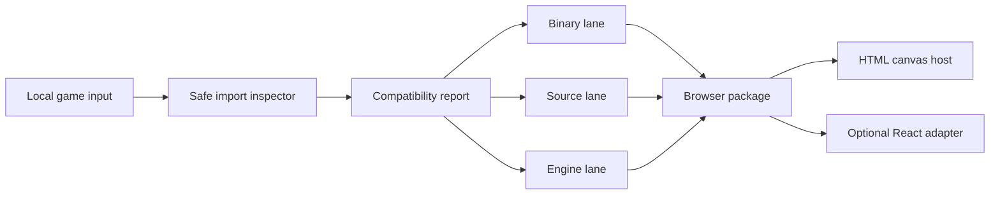
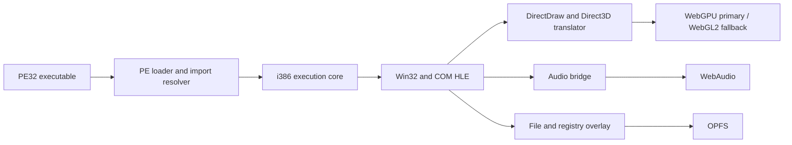

# Architecture

## Status

This document describes the implemented package boundary and the target runtime architecture. The opt-in entry probe executes a bounded guest-integer subset, but neither local analysis nor that probe establishes game execution or browser compatibility.

## Repository tooling boundary

The current package source additionally exposes atomic asset packaging, HTML and React host-source emission, privacy-minimized local reporting, and platform-policy diagnosis. The command uses Node.js built-ins only and never uploads imported content. It has a bounded PE32 image mapper, declared import binding, live browser capability probe, and opt-in deterministic i386 entry probe. It has no complete CPU core, Win32 shim, graphics translator, executable browser host, or compatibility runner.

BPTK-003, BPTK-007, BPTK-008, and BPTK-017 are implemented but red because their operational prerequisite, approved corpus input, or complete profile remain red. The legal, corpus, and security command expose useful governance state without promoting BPTK-001, BPTK-002, or BPTK-004. Passing coverage remains 0 / 33.

## Implemented package boundary

`lib/input.mjs` resolves a local file or directory, rejects symbolic-link roots, refuses path escape, bounds entry count, depth, and per-file size, and does not follow nested symbolic links. The reader returns metadata plus a bounded file prefix; it never launches content or opens a network connection.

`lib/inspect.mjs` recognizes PE and DOS signatures, ZIP and OLE container signatures, source projects with native build metadata, and common engine-asset suffix. Its terminal result is `classified`, with a lane and explicit blocker. Classification is not compatibility.

`lib/legal.mjs`, `lib/corpus.mjs`, and `lib/security.mjs` expose missing review, denominator, threshold, and threat-control state. Each fails closed: no absent reviewer is inferred and no local scan is called approval.

`lib/benchmark.mjs` generates its input in memory, repeats a deterministic digest operation, and checks content-addressed status/count invariants. Its live result is not retained and cannot promote while BPTK-001 and BPTK-002 are red.

`lib/foundation.mjs` and `lib/port.mjs` combine real input classification with local executable discovery. They report that Emscripten and the SDL/OpenGL adapter are absent on this host and never call a scaffold a runnable package.

`lib/pe.mjs` maps a bounded PE32/i386 image, validates header, section, file, image, memory-reserve, import, relocation, TLS, and executable entry-point range, and applies supported HIGHLOW relocation when a different base is requested. It resolves ordinary named and ordinal import only when the package declares one exact external address per binding, patches the mapped IAT deterministically, and reports every unresolved symbol. It parses bounded TLS raw-data, index, and executable callback metadata without invoking a callback. `lib/run.mjs` exposes this through a raw executable or a directory containing strict `bptk.json`; a raw executable has no declared import catalog. The image hash is calculated after relocation and import patching. Raw executable and package without an execution profile stay static with `is_executed: false`. A package may select `i386_probe_v1` with an explicit instruction budget; `lib/i386.mjs` then runs the mapped entry through the deterministic `lib/runtime.mjs` integer subset. The probe supports bounded register and memory MOV/LEA, integer ALU flag behavior, stack, CALL/RET, JMP/Jcc, ModRM access, self-modification, shift and rotate, multiply and divide with structured divide_error, setcc, string operation with bounded repeat prefix, and a 64-bit precision x87 subset. Import or TLS callback refuses execution. Unsupported instruction including x87, fetch/read/write fault, entry return, and exact budget exhaustion produce structured stop state. Full instruction, FPU, exception, Win32, timing, and game-loop behavior remain unavailable. `lib/extract.mjs` adds static installer extraction: it detects the Inno Setup 6 unicode loader and MSCF cabinet containers, walks the real offset-table, block, header-chain, data-entry, and chunk structure under `lib/bound.mjs` declared bound, and writes the payload only to a caller-declared directory without executing installer code; `lib/import.mjs` exposes extraction through `bptk import`. `lib/ingest.mjs` adds one-command ingestion for any executable input in the style of the closest prior art: the input is classified and census-routed, a supported installer is extracted under the declared bound, a plain Windows PE is copied into a synthesized bundle with an opt-in manifest, and the bounded i386 probe eligibility is reported; DOS, 16-bit, and archive input stay structured refusal. `lib/clock.mjs` derives every guest time source from one monotonic base with a clamped delta and serves the probe RDTSC deterministically in virtual mode. `lib/census.mjs` adds the static middleware, copy-protection, and engine census over the same bounded inspection prefix: named signature catalog produce a handle, warn, extract, or refuse route, refuse blocks the lane, and engine asset evidence routes to a named open reimplementation without bundling code.

`lib/graphics.mjs` discovers a local Chrome or Chromium executable and launches it headlessly against an in-memory data document. The document creates a real canvas context and observes WebGPU, WebGL2, WebGL, AudioContext, cross-origin isolation, SharedArrayBuffer, and renderer state. The result is removed with the browser process and not retained. One observed Chrome profile cannot establish cross-browser compatibility.

`lib/package.mjs` reads a bounded project, splits each file into content-addressed chunk, writes a manifest in a sibling staging directory, and renames that directory atomically. Its HTML host owns the canvas and lifecycle boundary; the React adapter mounts an iframe around that host and never owns a game loop. Both carry the same package identity, but the package is asset-only until a runtime exists.

`lib/report.mjs` reads package identity and emits a privacy-minimized environment report. Recording is off by default. Consent writes locally inside the package, excludes game content and personal data, and does not imply that a runtime session was reproduced.

`lib/performance.mjs` verifies every content-addressed package chunk twice and reports ephemeral cold and warm read timing. It does not substitute asset I/O for startup, frame, audio, CPU, or game-runtime memory evidence.

`lib/platform.mjs` observes browser isolation before writing thread selection, validates zero-attempt network policy and logical control profile, and diagnoses browser-profile availability. These are configuration and policy surfaces only: no worker, network, input, or game-runtime bridge exists. `lib/engine.mjs` safely classifies an adapter asset and copies nothing while rights and adapter approval are absent.

`lib/storage.mjs` validates one package save profile and reports a read-only base without creating an overlay. `lib/import.mjs` combines safe inspection with asset-package launch diagnosis while staging and executing nothing. Both expose the literal integration boundary, not persistence or a first playable.

`lib/research.mjs` scans only the bounded input prefix for architecture or graphics-API signal and combines it with the ephemeral Chrome probe. It returns a defer decision for x86-64, D3D11, and modern targets because no execution or translation prototype exists; browser memory64 or WebGPU capability alone is never a support claim.

## Product boundary

BPTK is a developer workbench and a browser runtime family. It is not one universal transpiler. Its first responsibility is to classify an import and select a viable lane:

The report is a valid terminal output. Unsupported input must fail closed with a machine-readable reason instead of crashing, uploading content, or pretending to produce a port.

## Shared workbench

All lane share a control plane. The implemented surface includes bounded import inspection, PE32 mapping, packaging, platform diagnosis, and the isolated i386 entry probe:

- **Importer**: currently reads bounded local metadata and file prefixes for folder, archive, installer container, executable, source tree, and engine asset without executing imported code.
- **Inspector**: currently identifies PE architecture, container or source form, candidate lane, and known blocker. Import-table, graphics-API, and middleware analysis remain planned.
- **Planner**: selects binary, source, engine, or unsupported state and produces ordered remediation.
- **Benchmark runner**: executes synthetic and redistributable fixture and records deterministic artifact.
- **Packager**: emits a static browser package plus plain HTML and optional React adapter.
- **Compatibility catalog**: stores observed capability and provenance, never unsupported “works” assertion.

## Binary lane

The binary lane is the closest analogue to Apple’s evaluation environment, adapted to browser constraints:

The P0 architecture spike compares three concrete option:

1. Adapt or collaborate with BottleShip, retaining its Apache-2.0 and third-party notice obligations.
2. Compose a smaller runtime from permissive component such as v86 and independently implemented HLE layer.
3. Build a new runtime only where a measured requirement or license boundary rules out reuse.

The decision record must measure compatibility, performance, maintainability, browser reach, license effect, and upstream relationship. A clean rewrite is not the default.

P1 component work is not complete merely because isolated PE, CPU, API, graphics, audio, and storage fixture pass. BPTK-016 owns one integrated synthetic PE32 2D package that imports, loads, becomes interactive, renders, plays audio, accepts input, saves, exits, reloads, and recovers state inside the threshold frozen by BPTK-002.

### Binary compatibility policy

- Implement generic API behavior and reusable quirk profile.
- Keep title-specific patch outside the core and require evidence that a generic fix is impossible.
- Never execute imported installer or executable on a server.
- Start with PE32 and i386; x86-64 is a research tier.
- Use a capability profile for WebGPU, WebGL2, thread, storage, codec, and input feature.

## Source lane

The source lane compiles available C or C++ source to WebAssembly through Emscripten and adapts native dependency to browser surface. It is often the better shipping route because it can remove emulation overhead and replace platform-specific behavior deliberately.

Planned adapter cover:

- SDL and browser main-loop behavior;
- OpenGL ES or WebGL-compatible rendering, with explicit legacy emulation cost;
- Emscripten file packaging and persistent storage;
- pthread build selection and cross-origin isolation deployment;
- WebSocket, WebRTC, or WebTransport networking instead of raw TCP or UDP;
- browser gesture, fullscreen, controller, keyboard, pointer-lock, and touch behavior.

The source lane must preserve upstream license and provide a patch ledger. It cannot make a proprietary game open source.

## Engine lane

OpenSA, WebXash, Qwasm2, and ScummVM demonstrate a different path: use a compatible open engine or engine-family implementation and let the player provide asset. This can give excellent compatibility within one family but does not generalize to arbitrary Windows executable.

BPTK will expose an engine adapter contract only after the binary and source packaging contract is stable. Each adapter must declare:

- accepted asset and executable format;
- ownership and redistribution requirement;
- exact engine and asset version;
- missing native module behavior;
- save, mod, network, and input support;
- deterministic benchmark fixture.

## Browser host boundary

The output package owns the canvas, worker, Wasm module, audio context, storage, and capability probe. Host framework integration is deliberately thin:

- plain HTML host is canonical;
- React adapter mounts, unmounts, resizes, and reports state;
- no game loop runs through React rendering;
- package remains deployable without a JavaScript framework.

BPTK-024 requires the integrated binary fixture and source-assisted fixture to validate against the same package schema and lifecycle API. Separate binary and source package formats do not satisfy the architecture.

## Security boundary

Imported content is hostile until proven otherwise. The target model is local-first and sandboxed:

- parse with bounded allocation, recursion, path, and archive expansion;
- prevent path traversal, device path, symlink escape, and executable host launch;
- isolate Wasm and worker; apply memory and time budget;
- require explicit user gesture for file, fullscreen, audio, pointer-lock, and controller access;
- default to no network; expose declared endpoint only through a mediated bridge;
- generate content hash and provenance without uploading private asset.

The detailed threat-model deliverable is BPTK-004.

## Compatibility truth model

A compatibility record is keyed by toolkit revision, fixture or user-supplied title hash, browser, browser version, operating system, architecture, GPU adapter, capability profile, and run artifact. `compatibility_state` is one of:

- `uninspected`
- `classified`
- `blocked`
- `boots`
- `interactive`
- `playable`
- `verified`

Evidence provenance is a separate `evidence_state`: `reported`, `observed`, `reproduced`, or `audited`. A community report begins as `reported`; one retained run can make it `observed`; an independent second run makes it `reproduced`; matrix and provenance review make it `audited`. A report may suggest a compatibility state, but only a reproducible benchmark can authoritatively advance `compatibility_state`.

## Primary uncertainty

The dominant unknown is not whether browser porting is possible. It is whether an maintainable, legally usable component combination can cover enough commercially relevant 32-bit game at acceptable performance. P0 exists to answer that before broad implementation.
